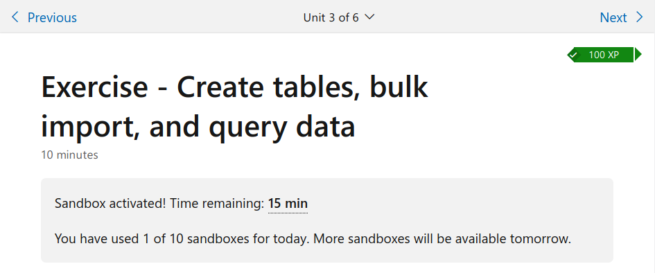

# Azure webhoszting

A labor során .NET Core alapú, adatbázist használó webalkalmazásokat kell Azure-ba telepíteni Azure SQL, illetve Azure App Service szolgáltatásokra építve. A műveleteket parancssorban, cross-platform eszközökkel végezzük. A felhőben linux alapú szerver fogja az alkalmazást futtatni, bár ebből sokat nem érzékelünk.

## Előkészületek

A mérés Windows és Linux rendszeren is teljesíthető. Telepítés előtt ajánlott ellenőrizni a lenti parancsokkal, hogy mi van már eleve feltelepítve.

Telepítendő parancssoros eszközök:    
 - Azure CLI - [Windows](https://aka.ms/installazurecliwindows) [Linux](https://docs.microsoft.com/hu-hu/cli/azure/install-azure-cli) 
 - [git](https://git-scm.com/downloads) (Visual Studio telepítő is feltelepíti)
 - [.NET Core 3.1 SDK](https://docs.microsoft.com/hu-hu/dotnet/core/install/) (Visual Studio telepítő is feltelepíti)
 
Egyéb kellékek:
 - [Windows Terminal](https://www.microsoft.com/hu-hu/p/windows-terminal/9n0dx20hk701?rtc=1&activetab=pivot:overviewtab) (opcionális, csak Windows-on telepíthető)
 - valamilyen szövegszerkesztő, pl. jegyzettömb, [Visual Studio Code](https://code.visualstudio.com/)

### Telepítés ellenőrzése

Azure CLI ellenőrzése, ajánlott verzió legalább v2.13
```bash
az --version
```
git ellenőrzése, ajánlott verzió legalább v2.28 (Windows), v2.17 (Linux)
```bash
git --version
```
.NET Core SDK ellenőrzése, legalább v3.1 legyen
```bash
dotnet --version
```

### Azure előfizetés beüzemelése
A mérés ún. sandbox előfizetéssel teljesítendő. Ezt az alábbi weboldalon lehet aktiválni: [link](
https://docs.microsoft.com/hu-hu/learn/modules/develop-app-that-queries-azure-sql/3-exercise-create-tables-bulk-import-query-data).
A `Sign in to activate sandbox` gombra nyomva. Belépéshez az edu.bme.hu fiókot kell használni. Ha még nem volt korábban ilyen előfizetés aktiválva a fiókhoz, akkor a kért engedélyt is meg kell adni a Microsoft Learn oldalnak.



Miután a fenti üzenet megjelenik, dolgozhatunk az előfizetéssel, de **ne a weboldal jobb oldalán lévő terminálon (Azure Cloud Shell)**, hanem egy sima terminálban, Windows-on Parancssorban (cmd) vagy Windows Terminal-ban (ez az ajánlott), Linuxon pedig a beépített terminálon. A parancsértelmező (azaz shell) is többfajta lehet, a mérésanyagban a cmd (Windows), PowerShell (Windows) és bash (Linux, WSL) szerepel. Ahol a futtatandó paramcs különbözik, az külön jelölve van. A Windows Parancssor alapból cmd-t indít,a Windows Terminal-ban választhatunk, hogy az új lap mivel induljon.

Jelentkezzünk be Azure CLI-vel az előfizetésbe:

```bash
az login
```

Ez egy böngészőlapot nyit meg, ahol be kell jelentkezni szintén az edu.bme.hu-s fiókkal. Ezt követően pár másodperc múlva a paramcs lefut, kilistázva az aktív előfizetéseket.

:warning::warning::warning: Fontos tudnivalók a sandbox előfizetésről:

- 4 óra időtartamig él
- egy fiókkal naponta max. 10 db. hozható létre
- nem minden régióban enged erőforrásokat létrehozni. Ha a `West Europe` régióban nem engedi, akkor használjuk a `Central US`-t,
- az előfizetésen belül nem hozható létre erőforráscsoport. Helyette egy már eleve létre van hozva `learn-<valamilyen azonosito>` névvel. A pontos nevet a következő paranccsal lehet lekérdezni:

```bash
az group list
```

A keresett név a válasz JSON `name` tulajdonságából olvasható ki.

## Feladatok

### Általános szabályok

:warning: A következő Azure erőforrások nevének *kötelezően* tartalmaznia kell a mérést végző neptun kódját: 

  - Azure SQL Server (`az sql server create` parancs hozza létre) 
  - Azure App Service (`az webapp create` parancs hozza létre). 
 
Ha névütközés miatt nem lehet simán a neptunkód, akkor kerüljön elé és/vagy mögé pár extra karakter. ABC123 neptun kód esetén az Azure SQL Server neve lehet például `abc123srv`.


### [Feladat 1](Feladat-1.md)

Ez egy hivatalos [Microsoft oktatóanyag](https://docs.microsoft.com/en-us/azure/app-service/tutorial-dotnetcore-sqldb-app) - a gépi magyar fordítás kézileg magyarított változata. A gépi fordítás nem túl jó, tehát ne az eredetit nézzétek, hanem [ezt](Feladat-1.md). Mielőtt nekiállnál, mindenképp olvasd el az eltérések részt, a tippeket és a beadndók leírását!

Mivel sandbox előfizetést használunk, van néhány :warning: fontos :warning: eltérés az eredeti, Microsoft által megálmodott folyamathoz képest:

- hiába kéri, hogy hozzunk létre erőforráscsoportot, nem tudunk, mert nincs hozzá jogunk. Helyette **minden további parancsban, ahol meg kell adni erőforráscsoportot**, a `myResourceGroup` helyett adjuk meg a sandbox előfizetésben alapból létrehozott erőforráscsoport nevét. Ennek a névnek a lekérdezését lásd fentebb az előfizetés beüzemelésénél.

- *[Az Azure App Service alkalmazás kezelése](Feladat-1.md#az-azure-app-service-alkalmazás-kezelése)* részben az előfizetés nem a BME domain-ben jön létre (ahová a fiók alapból tartozik), ezért alapból valószínűleg nem látszanak a szolgáltatások az Azure portálon. Előbb át kell váltani a könyvtárat a `learn.docs.microsoft.com`-ra a jobb felső sarokban lévő ikonra kattintva, ahogy ezen a [képen](media/switch_azure_directory.png) látható.

:bulb: Tippek és hasznos tudnivalók:

:bulb: érdemes legalább két konzolablakot használni, mindkettőben ugyanabban a könyvtárban állni, de az egyikben csak az Azure CLI (`az` kezdetű) parancsokat futtatni, a másikban minden mást

:bulb: a munkakönyvtár (ahol a parancssorunk áll) legyen egyszerű, pl. c:\work (Windows) vagy ~/src (Linux)

:bulb: érdemes egy jegyzettömböt is nyitni és a különböző többször használatos értékeket ment közben feljegyezni (connection string, erőforráscsoport neve, stb.)

:bulb: ha az Azure-ban futó változattal gond van, érdemes előrevenni a [diagnosztikai naplók lekérdezéséről szóló részt](Feladat-1.md#diagnosztikai-naplók-lekérdezése-log-streaming-funkcióval)

:bulb: a [diagnosztikai naplók lekérdezéséről szóló rész](Feladat-1.md#diagnosztikai-naplók-lekérdezése-log-streaming-funkcióval) és az [Azure portálos rész](Feladat-1.md#az-azure-app-service-alkalmazás-kezelése) már az App Service létrehozása is után megoldható, nem kell a végéig elérni a megoldással.

:bulb: ha az első feladatot túl sokáig tartott megoldani (> 2óra), akkor érdemesebb új sandbox előfizetést aktiválni (azaz hagyni lejárni az előzőt). Semmilyen erőforrásra nincs szükség a második feladathoz az elsőből


:warning: ha Visual Studio Code-ot használunk szövegszerkesztőként, akkor minden kódfájl módosítás után explicit mentsük el a fájlt (CTRL+S), különben a `git`, `dotnet ef` parancsok nem fogják érzékelni a változásokat

:warning: a connection string beállítása csak a parancssori ablak bezárásig él

:warning: a környezeti változóban megadott connection string csak a lokális alkalmazásban működik

### [Feladat 2](Feladat-2.md)

Ez már nem fordítás, minden infó a [feladat oldalán](Feladat-2.md).

:bulb: Ha már kevés idő van hátra az előfizetésből, akkor inkább várd meg amíg lejár.

## Beadandó

### Általános elvek

Beadandó egy összecsomagolt állomány, melyben képernyőképek vannak jpg vagy png formátumban. 

Terminálparancsok kimenetéről készült képernyőképeknél: 

    - a terminál ablaka teljes méretű (maximalizált) legyen
    - ha a parancs kimenete olyan hosszú, hogy nem férne rá egy képernyőre, akkor scrollozzatok föl, hogy a parancs a képernyő tetején legyen és így csináljátok a képernyőképet. (Ha így sem fér rá, nem baj, ilyenkor már nem kell a teljes kimenetnek látszani)
    - bár elsődleges a kimenet, látszódjon a futtatott parancs és alatta a kimenet is

Böngészőről készült képernyőképeknél:

   - a böngészőablak teljes méretű (maximalizált legyen) 
   - a címsor látszódjon és a weboldal mejelenő része


Az egy feladathoz tartozó beadott képek ugyanazon előfizetés használatát mutassák. Például az első feladat Azure CLI belépésről  és App Service létrehozásról beadott kép ne különböző sandbox előfizetések használata során jöjjenek létre. Feladatok (az első és második) között lehet eltérés.

### Beadandó - Feladat 1

- képernyőképek az alábbi parancsok kimenetéről:
    - **Azure CLI belépés** (`az login`); képernyőkép fájlneve kiterjesztés nélkül: `f1_azlogin`
    - **Azure SQL szerver létrehozása;** `f1_sqlsrv`
    - **Azure SQL adatbázis létrehozása;** `f1_sqldb`
    - **Azure App Service Plan létrehozása;** `f1_appplan`
    - **Azure Web App létrehozása;** `f1_app`
    - **git push Azure-ba - az eredeti, első push**; `f1_push1`
    - git push Azure-ba - a módosított (`Done` property hozzáadása után); `f1_push2`
    - **diagnosztikai napló lekérdezése (`az webapp log tail`) egy új teendő létrehozása után** (ha a módosítás nem készült el, akkor lehet az eredeti változatról is) ; `f1_log`

- képernyőképek a böngészőben futó Azure Web App főoldaláról:
    - **az eredeti változat futása** ([példa](media/tutorial-dotnetcore-sqldb-app/azure-app-in-browser.png)); `f1_v1`
    - a módosított változat futása ([példa](media/tutorial-dotnetcore-sqldb-app/this-one-is-done.png)); `f1_v2`

- képernyőképek az Azure portálról:
    - **az Azure Web App áttekintő oldala** ([példa](media/tutorial-dotnetcore-sqldb-app/web-app-blade.png)); `f1_portal`

### Beadandó - Feladat 2

- képernyőképek az alábbi parancsok kimenetéről:
    - Azure SQL adatbázis létrehozása; `f2_sqldb`
    - Azure Web App létrehozása; `f2_app`
    - git push Azure-ba - az eredeti, első push; `f2_push`
    - diagnosztikai napló lekérdezése egy film módosítása után `az webapp log tail`; `f2_log`

- képernyőképek a böngészőben futó Azure Web App-ról:
    - főoldalról; `f2_index`
    - valamely film szerkesztő oldaláról; `f2_detail`

- képernyőképek az Azure portálról:
    - az Azure Web App áttekintő oldala; `f2_portal`

## Értékelési irányelvek

- ha nincs meg minden **kiemelt** kép az első feladatból -> 1
- ha csak a **kiemelt** képek készülnek el az első feladatból -> 2
- ha minden elkészül az első feladatból -> 3
- ha minden elkészül az első és a második feladatból is -> 5

