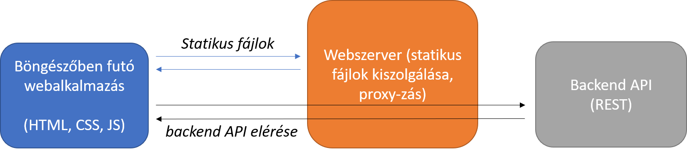

# HTML + CSS + JavaScript/TypeScript mérés
Ennek a labornak a célja a három alapvető webes technológia, a HTML, CSS és JavaScript (TypeScript) nyelvek gyakorlása egy összetett példán keresztül. A feladat egy Twitterhez hasonló, rövid üzenetek publikálására és lekérdezésére alkalmas webalkalmazás és egy azt kiszolgáló szerver elkészítése lesz.

A megvalósítandó alkalmazás két részből áll:
1. A backend a [NodeJS](https://nodejs.org/en/) JavaScript motoron futtatott [ExpressJS keretrendszer](https://expressjs.com/)t használó alkalmazás, amit TypeScript nyelven kell elkészíteni. 
2. A frontend egy egyszerű HTML oldal és hozzátartozó JavaScript kód, amelyet szintén TypeScript nyelven fogunk megírni. Ebben a példában még nem használunk semmilyen frontend keretrendszert.

A feladathoz semmilyen kezdő kódot nem használunk fel, mindent mi fogunk megírni, a projekteket is mindenki maga készíti el. Fejlesztéshez és futtatáshoz mindössze a [NodeJS](https://nodejs.org/en/)re lesz szükség, továbbá egy szövegszerkesztőre. Javasoljuk a [Visual Studio Code (`vscode`)](https://code.visualstudio.com/) használatát. (Egyik feladathoz szükség lesz egy ingyenes segédalkalmazásra, de erről majd később részletesen.)

## Beadandó
1. Forráskód: mind a kliens, mind a szerver forráskódja, a **`node_modules` mappa nélkül!!!** 
2. Jegyzőkönyv: 
    * PDF formátumban
    * Tartalmazza a hallgató adatait (név, neptun kód), dátumot
    * A feladatleírásban pontosan szerepel, hogy miről kell írni, vagy képernyőképet készíteni a jegyzőkönyvben. Amit külön nem említünk, arról nem kell írni. 

## Architektúra

Mielőtt nekilátunk a kód elkészítéséhez, tekintsük át, hogy az alkalmazás milyen komponensekből fog állni: 

* A backend alkalmazás egy szerver, amely egy adott hálózati címen (IP cím és portszám) figyel és várja a bejövő kéréseket. HTTP végpontokat biztosít majd, amelyen keresztül az üzenetek publikálása és lekérdezése megvalósítható. Ezt nevezzük REST API-nak. Tegyük fel, hogy a backend alkalmazást a `localhost:3000` hálózati címen érjük el. Ekkor például a `localhost:3000/tweets` URL-re küldött HTTP GET kérés visszaadhatja az összes tweetet, vagy az ugyanerre a címre küldött POST kéréssel küldhetünk új üzenetet.
    * A backend JavaScript kódját NodeJS futtatja. 
    * A JavaScript helyett TypeScript nyelven kódolunk, majd a TypeScript fordítóval lefordítjuk a TypeScript fájlokat JavaScript fájlokká. 
* A böngészőben futó webalkalmazás egy egyszerű HTML fájlból és egyetlen hozzátartozó JavaScript fájlból fog állni. 
* Ahhoz, hogy a böngészőben futtatni tudjuk a webalkalmazást, kell egy webszerver, ami kiszolgálja a statikus fájlokat. Például, tegyük fel, hogy a `localhost:8080` címen figyel a webszerver.  A böngészőben futó webalkalmazásnak a backenddel is kommunikálnia kell. Ez megtehető úgy, hogy a webalkalmazás közvetlenül a backend hálózati címére küldi a kéréseit, vagy úgy, hogy a webszervert felhasználjuk proxy-nak. Ez azt jelenti, hogy ha olyan kérés érkezik a webszerverhez, amely nem egy statikus fájlra vonatkozik, akkor a kérést közvetlenül továbbítja a backendnek. Tehát ha a böngésző a webszervernek a `localhost:8080/index.html` címére küld egy HTTP `GET` kérést, akkor visszaadja az eltárolt `index.html` fájlt, de ha a `localhost:8080/tweets` címére küld egy kérést, akkor azt továbbítja a `localhost:3000/tweets` URL-re. Így a böngészőben futó webalkalmazás nem is tudja, hogy a háttérben egy másik backend alkalmazás van, nem kell tudnia annak hálózati címét. Ennek a megközelítésnek pl. biztonság szempontjából is több előnye van. 

[Kezdjük a szerveralkalmazással](Feladat-1.md). 
