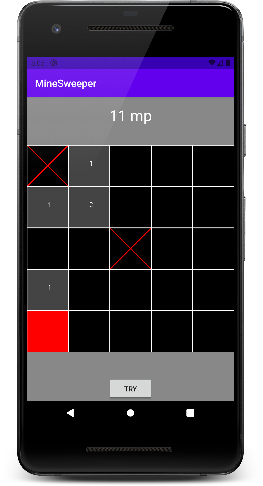

# Android 2

## Aknakereső Android alkalmazás fejlesztése 

## Bevezetés

A labor során Android platformra kell elkészíteni egy Aknakereső játékot Kotlin nyelven:

[http://en.wikipedia.org/wiki/Minesweeper_(video_game)](http://en.wikipedia.org/wiki/Minesweeper_(video_game))



### Szabályok

A labor során az idő rövidsége miatt elegendő, ha az alkalmazás az alábbi megkötésekkel üzemel:

* 5x5 játéktér elég
* 3 akna elég
* nem kell teljes feltöltő logikát írni, elég ha be van égetve egy fix elrendezés
* a felületen elhelyezhető egy ToggleButton vagy checkbox az akció kiválasztásához:
    * zászló lehelyezése
    * mező kipróbálása
* Ha a kipróbált mező:
    * akna, a játék véget ér
    * nem akna, akkor megjelenik egy szám, ami a szomszédos aknák számát jelzi

Érdemes először végigolvasni az összes feladatot, hogy aki minden funkciót szeretne megvalósítani, már az elején úgy tervezhessen, és ne közben kelljen módosítani az adatmodellen pl.
Az alkalmazás elkészítése során törekedj a strukturált felépítésre, kódszervezésére. Készíts letisztult, ergonomikus felhasználói felületeket, figyelj a vissza gomb megfelelő működésére, továbbá a hibák kezelésére és a felhasználó számára történő releváns visszajelzésekre.


### Értékelés

Az Alapok rész hiánytalan megvalósítása esetén sikeres (elégséges) a labor. Az Alapok részen kívül megoldott minden további részfeladat hiánytalan megvalósítása plusz egy jegyet jelent. A feladatok részben egymásra épülnek, ezért az ebből következő hiányok – feladat kihagyás esetén – szükség szerint áthidalhatók pl. dummy adatok használatával.


## Előkészületek

A feladatok megoldása során ne felejtsd el követni a [feladat beadás folyamatát](../../tudnivalok/github/GitHub.md).

### Git repository létrehozása és letöltése

1. Moodle-ben keresd meg a laborhoz tartozó meghívó URL-jét és annak segítségével hozd létre a saját repository-dat.

1. Várd meg, míg elkészül a repository, majd checkout-old ki.

    !!! warning "Checkout"
        Egyetemi laborokban, ha a checkout során nem kér a rendszer felhasználónevet és jelszót, és nem sikerül a checkout, akkor valószínűleg a gépen korábban megjegyzett felhasználónévvel próbálkozott a rendszer. Először töröld ki a mentett belépési adatokat (lásd [itt](../../tudnivalok/github/GitHub-credentials.md)), és próbáld újra.

1. Hozz létre egy új ágat `megoldas` néven, és ezen az ágon dolgozz.

1. A `neptun.txt` fájlba írd bele a Neptun kódodat. A fájlban semmi más ne szerepeljen, csak egyetlen sorban a Neptun kód 6 karaktere.

### Projekt létrehozása

Első lépésként indítsuk el az Android Studio-t, majd:

1. Hozzunk létre egy új projektet, válasszuk az *Empty Views Activity* lehetőséget.
1. A projekt neve legyen `MineSweeper`, a kezdő package pedig `hu.bme.aut.klaf.minesweeper`.
1. Nyelvnek válasszuk a *Kotlin*-t.
1. A minimum API szint legyen API24: Android 7.0.
1. A *Build configuration language* Kotlin DSL legyen.

!!!danger "FILE PATH"
	A projekt mindenképpen a repository-ban lévő MineSweeper könyvtárba kerüljön, és beadásnál legyen is felpusholva! A kód nélkül nem tudunk maximális pontot adni a laborra!


## 1. Alapok (2 pont)

!!!warning "Tippek"

	* Törekedj a rövid osztályokra és függvényekre, valamint az átlátható forráskódra!
	* Ügyelj a megfelelően hierarchikus *package* szervezésre, a kódolás során tartsd szem előtt a *Clean Code* elveket!
	* Kezeld megfelelően a készülék elforgatása során bekövetkező életciklus változásokat!
	* Perzisztenciánál figyelj a megfelelő szálkezelésre!
	* A feladat megvalósítása és beadása során önálló, egyedi munkákat várunk!

### Egyedi ikon

Állíts be az alkalmazásnak egyedi vagy saját készítésű ikont.

### Főmenü

Az alkalmazás indulása után egy főmenü jelenjen meg két gombbal: "Új játék" és "Eredmények"

Az "Új játék" gomb megnyomására egy új felületen jelenjen meg a játéktér, amin érintés esemény hatására változnak az egyes mezők. Mivel itt több elem együttes működésére van szükség, a lépéseket és mintakódokat biztosítunk.

### Játék motor

A játék állapotának nyilvántartásához szükségünk lesz egy mező osztályra és egy singleton model osztályra:

```kotlin
data class Tile(
    var type: TileType = TileType.FIELD_TYPE_NORMAL,
    var minesAround: Byte = 0, //-1 means mine
) {
    enum class TileType {
        FIELD_TYPE_NORMAL,
        FIELD_TYPE_REVEALED,
        FIELD_TYPE_FLAGGED
    }
}
```

```kotlin
object MineSweeperModel {

    var fieldMatrix: Array<Array<Tile>> = arrayOf(
                arrayOf(
                    Tile(Tile.TileType.FIELD_TYPE_NORMAL, 1),
                    Tile(Tile.TileType.FIELD_TYPE_NORMAL, 1),
                    ...
                ),
                arrayOf(
                    Tile(Tile.TileType.FIELD_TYPE_NORMAL, 2),
                    Tile(Tile.TileType.FIELD_TYPE_FLAGGED, -1),
                    ...
                ),
                ...
                )
            )

    fun initGameArea() {
	...
    }

    fun getFieldContent(x: Int, y: Int): Tile {
        return fieldMatrix[x][y]
    }
```

### Felület

A képernyőn való megjelenítéshez szükségünk lesz egy saját View-ra, minek felül kell írni az alábbi függvényeit:

* onDraw: itt történik a view kirajzolása. Ezt jelenleg két részre bontottuk: a játéktér és a játékállapot kirajzolása.
* onMeasure: ahhoz szükséges, hogy megállapítsuk a megfelelő dimenziókat egy maximális négyzet rajzolásához.
* onTouchEvent: az érintés események lekezelése. Itt kell az felhasználói akció és a meglévő modell alapján változtatni a modellt. A végén az *invalidate()* hatására rajzolódik újra a view.
        
```kotlin
class MineSweeperView : View {

    private val paintBg = Paint()
    private val paintLine = Paint()

    constructor(context: Context?) : super(context)
    constructor(context: Context?, attrs: AttributeSet?) : super(context, attrs)

    init {
        paintBg.color = Color.BLACK
        paintBg.style = Paint.Style.FILL

        paintLine.color = Color.WHITE
        paintLine.style = Paint.Style.STROKE
        paintLine.strokeWidth = 5F
    }

    override fun onDraw(canvas: Canvas) {
        canvas.drawRect(0F, 0F, width.toFloat(), height.toFloat(), paintBg)

        drawGameArea(canvas)
        drawGameState(canvas)

    }

    private fun drawGameArea(canvas: Canvas) {
        val widthFloat: Float = width.toFloat()
        val heightFloat: Float = height.toFloat()

        // border
        canvas.drawRect(0F, 0F, widthFloat, heightFloat, paintLine)

        // four horizontal lines
        canvas.drawLine(0F, heightFloat / 5, widthFloat, heightFloat / 5, paintLine)
        canvas.drawLine(0F, 2 * heightFloat / 5, widthFloat, 2 * heightFloat / 5, paintLine)
        ...

        // four vertical lines
        canvas.drawLine(widthFloat / 5, 0F, widthFloat / 5, heightFloat, paintLine)
        canvas.drawLine(2 * widthFloat / 5, 0F, 2 * widthFloat / 5, heightFloat, paintLine)
        ...
    }

    private fun drawGameState(canvas: Canvas) {
        for (i in 0 until 5) {
            for (j in 0 until 5) {
                if (MineSweeperModel.getFieldContent(i, j).type == Tile.TileType.FIELD_TYPE_FLAGGED) {
                    canvas.drawLine(
                        (i * width / 5).toFloat(),
                        (j * height / 5).toFloat(),
                        ((i + 1) * width / 5).toFloat(),
                        ((j + 1) * height / 5).toFloat(),
                        paintLine
                    )
                    canvas.drawLine(
                        ((i + 1) * width / 5).toFloat(),
                        (j * height / 5).toFloat(),
                        (i * width / 5).toFloat(),
                        ((j + 1) * height / 5).toFloat(),
                        paintLine
                    )
                }
				...
            }
        }
    }

    override fun onMeasure(widthMeasureSpec: Int, heightMeasureSpec: Int) {
        val w = View.MeasureSpec.getSize(widthMeasureSpec)
        val h = View.MeasureSpec.getSize(heightMeasureSpec)
        val d: Int

        when {
            w == 0 -> {
                d = h
            }
            h == 0 -> {
                d = w
            }
            else -> {
                d = min(w, h)
            }
        }

        setMeasuredDimension(d, d)
    }

    override fun onTouchEvent(event: MotionEvent?): Boolean {
        when (event?.action) {
            MotionEvent.ACTION_DOWN -> {
                val tX: Int = (event.x / (width / 5)).toInt()
                val tY: Int = (event.y / (height / 5)).toInt()
                if (tX < 5 && tY < 5 && MineSweeperModel.getFieldContent(tX, tY).type == Tile.TileType.FIELD_TYPE_NORMAL) {
                    ...
                    invalidate()
                }
                return true
            }
            else -> return super.onTouchEvent(event)
        }
    }
```

* A saját view ezek után teljes package hivatkozással már használható is a felületen: 

```xml
<hu.bme.aut.klaf.minesweeper.view.MineSweeperView
    android:id="@+id/mineSweeperView"
    android:layout_width="wrap_content"
    android:layout_height="wrap_content"
    .../>
```


!!! example "BEADANDÓ (2 pont)"
	Ebben a fázisban az alkalmazásnak képesnek kell lennie az érintés eseményre reagálni. Vagyis: E mezőhöz való hozzáérésnél valamilyen változást kell látnunk a játéktéren.

    Készíts egy **képernyőképet**, amelyen látszik a **futó alkalmazás** és **egy hozzá tartozó kódrészlet**. 

	A képet a megoldásban a repository-ba f1.png néven töltsd föl.


## 2. Bombák, zászlók, számok megjelenítése (1 pont)

Ha már a játéktér megjelenik a felületen és össze van kötve a modellel, készítsd el és tedd használhatóvá a játék különbözö elemeit (grafikusan mindegyik máshogy jelenjen meg):

* A megérintett mező színe változzon meg, hogy egyértelmű legyen, hogy az már fel van fedve.
* Ha a megérintett mező alatt bomba van, az legyen egyértelműen jelezve.
* Ha a megérintett mező alatt szám van, az jelenjen meg.
* Legyen lehetőség zászlók letételére és felvételére még nem megnézett mezőn. (Ez bármilyen módszerrel történhet, egy lehetséges mód ToggleButton elhelyezése a felületen, amivel a következő akció állítható)

!!! example "BEADANDÓ (1 pont)"
    Készíts egy **képernyőképet**, amelyen látszik a **futó alkalmazás a feladatnak megfelelő állapotban** és **egy hozzá tartozó kódrészlet**. 

	A képet a megoldásban a repository-ba f2.png néven töltsd föl.


## 3. Játék vége és időmérés (1 pont)

A felületre helyezz el egy futó órát, ami a megoldás idejét számolja.
Készítsd el a játék befejezésének logikáját, és a befejezést jelezze dialógusablakban:
    
* Ha egy bomba felfedésre kerül, a játék vereséggel véget ér.
* Ha a bombák kivételével az összes mező felfedésre került, a játék győzelemmel ér véget. Ekkor a dialógusablakban jelenjen meg a felhasznált idő is.

!!! example "BEADANDÓ (1 pont)"
    Készíts egy **képernyőképet**, amelyen látszik a **futó alkalmazás az órával** és **egy hozzá tartozó kódrészlet**. 

	A képet a megoldásban a repository-ba f3.png néven töltsd föl.


## 4. Perzisztencia (1 pont)

Ha a játék győzelemmel ér véget, kérjen be egy felhasználónevet, és ezt az idővel együtt mentse el perzisztensen.

Valósítsd meg az "Eredmények" gomb funkcionalitását! Nyíljon meg egy új felület, amin egy listában láthatóak a nevek és az elért időeredmények.

!!! example "BEADANDÓ (1 pont)"
    Készíts egy **képernyőképet**, amelyen látszik a **futó alkalmazás a játék vége dialógussal** és **egy hozzá tartozó kódrészlet**. 

	A képet a megoldásban a repository-ba f4.png néven töltsd föl.