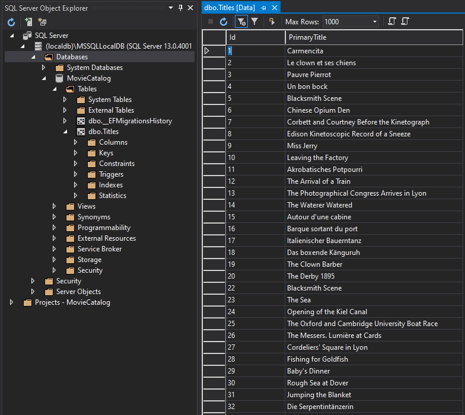

# Feladat 2: Adatbetöltés

Az adatbetöltést az IMDb által minden nap közzétett TSV (tabulátorral elválasztott értékek) típusú fájlok alapján végezzük. A hivatalos dokumentáció ezekről a fájlokról itt található: [IMDb Datasets (https://www.imdb.com/interfaces/))](https://www.imdb.com/interfaces/). Minket most a `title.basics.tsv.gz` fájl érdekel, ami a megfelelő adatokat tartalmazza ahhoz, hogy filmek alapadatait (cím, kiadás dátuma, műfaj) tárolhassuk.

A fájl tehát egy GZIP-pel tömörített szöveges fájl, nyersen az alábbihoz hasonló adatokat találhatunk benne (az első sor a fejlécet jelöli):

```
tconst	titleType	primaryTitle	originalTitle	isAdult	startYear	endYear	runtimeMinutes	genres
tt0000001	short	Carmencita	Carmencita	0	1894	\N	1	Documentary,Short
tt0000002	short	Le clown et ses chiens	Le clown et ses chiens	0	1892	\N	5	Animation,Short
tt0000003	short	Pauvre Pierrot	Pauvre Pierrot	0	1892	\N	4	Animation,Comedy,Romance
tt0000004	short	Un bon bock	Un bon bock	0	1892	\N	12	Animation,Short
tt0000005	short	Blacksmith Scene	Blacksmith Scene	0	1893	\N	1	Comedy,Short
tt0000006	short	Chinese Opium Den	Chinese Opium Den	0	1894	\N	1	Short
tt0000007	short	Corbett and Courtney Before the Kinetograph	Corbett and Courtney Before the Kinetograph	0	1894	\N	1	Short,Sport
tt0000008	short	Edison Kinetoscopic Record of a Sneeze	Edison Kinetoscopic Record of a Sneeze	0	1894	\N	1	Documentary,Short
tt0000009	short	Miss Jerry	Miss Jerry	0	1894	\N	40	Romance,Short
```

1. A Data projektbe vegyük fel az alábbi osztályt, ami a TSV fájlok dekódolásában fog nekünk segíteni. A fájl tartalmát nem kell megértenünk, de az alapműködést igen, amit alább részletezve láthatunk.

``` C#
using System.IO.Compression;

namespace MovieCatalog.Data
{
    public class TsvParser
    {
        public static IEnumerable<IReadOnlyDictionary<string, string?>> ParseTsv(string filePath)
        {
            using var reader = new StreamReader(new GZipStream(File.OpenRead(filePath), CompressionMode.Decompress));

            var headers = reader.ReadLine()?.Split('\t');
            if (headers == null)
                yield break;
            while (reader.ReadLine() is var line && !string.IsNullOrWhiteSpace(line))
            {
                yield return new Dictionary<string, string?>(
                    line.Split('\t').Select((item, index) 
                                => new KeyValuePair<string, string?>(headers[index], item != @"\N" ? item : null)));
            }
        }
    }
}
```

A függvényt meghívva feldolgozás kezdődik meg a `filePath` elérési útvonalon található TSV fájlon. Az első sor a fejléc, ez tartalmazza, hogy hány érték található minden ezt követő sorban. A `\N` jelölésű sorok `null` értéket jelölnek. Ezt követően soronként ennyi értéket találunk a TSV fájlban. A fájlból soronként olvasva visszaadunk 1-1 értéket egy szótár formájában, amiből a dokumentáció alapján definiált kulccsal kiindexelhetjük a TSV fájlban található string értékeket.

2. Vegyük fel az alábbi függvényt a `MovieCatalogDbContext` osztályba:
``` C#
using System.Linq;
using System.Threading.Tasks;

// ...

public async Task ImportFromFileAsync(string filePath, int? maxValues = 100_000)
{
    var tsvQuery = TsvParser.ParseTsv(filePath)
        .Select(item
            => new Title(item["primaryTitle"] ?? throw new ArgumentNullException("Null title"))
            {
                Id = int.Parse(item["tconst"]?[2..] ?? throw new InvalidOperationException("Null id")),
                // A 'tconst' értéke a fájlban pl. 'tt6723592', a [..] range operátorral a 'tt'-t az elejéről levágjuk,
                // a maradékot pedig egész számmá alakítjuk
            });

    int idx = 0;
    foreach (var item in tsvQuery)
    {
        Titles.Add(item);
        idx++;
        if (idx == maxValues)
        {
            var saved = await SaveChangesAsync();
            Logger.LogInformation($"Saved {saved} rows.");
            idx = 0;
        }
    }
    var savedFinal = await SaveChangesAsync();
    Logger.LogInformation($"Saved {savedFinal} rows. Total:{Titles.Count()} rows");
}

```

- Mivel arra készülünk, hogy a fájl és tartalma óriási is lehet, ezért 100 000-es lépésközönként szúrjuk csak be az adatbázisba az elemeket.
- Ezért kellett, hogy ne a teljes fájlt egyszerre beolvassuk, hanem gyakorlatilag soronként streameljük a fájlból a szótárakat, azokat pedig transzformáljuk Title típusú elemekre. Ha a géped nem bírja, a maxValues értéket leveheted 10 000-re.

3. Töltsük le a gépünkre az aktuális `title.basics.tsv.gz` fájl ([IMDb data files available for download (https://datasets.imdbws.com/, ~124 MB!)](https://datasets.imdbws.com/)) helyett egy [jelentősen kisebb, csak az első 100 000 sort tartalmazó részletet itt (~2 MB)](res/title.basics.stub.tsv.gz).

``` C#
using Microsoft.EntityFrameworkCore;

// ...

public async Task StartAsync(CancellationToken cancellationToken)
{
    Logger.LogInformation("Starting...");

    //...korábbi kódok kikommentezve...

    if (!await DbContext.Titles.AnyAsync(cancellationToken))
        await DbContext.ImportFromFileAsync(@"C:\------\title.basics.tsv.gz"); 
                                       // Az útvonal értelemszerűen kitöltendő.

    await Host.StopAsync();
}
```

Futtatás előtt ürítsük ki a **Titles** táblát!

Ezzel be is kerülnek az adatok az adatbázisba:



# Feladat 2.

A fenti példa és a dokumentáció (https://www.imdb.com/interfaces/) alapján bővítsd a Title osztály modelljét és a betöltés során a Title objektumok előállítását az alábbi tulajdonságokkal! A tulajdonság neve C#-ban PascalCase-ben legyen, bár a szótárban camelCase-ben van.

- `TitleType`: legyen egy saját szintén `TitleType` névre hallgató enum típus a Data projektben, aminek az értékei: `Unknown`, `Short`, `Movie`, `TvMovie`, `TvSeries`, `TvEpisode`, `TvShort`, `TvMiniSeries`, `TvSpecial`, `TvPilot` , `Video`, `VideoGame`. Az enum értéke a TSV-ben string-ként van tárolva (pl. tvShort), használd a feldolgozáshoz az `Enum.Parse` függvény megfelelő overloadját! **Gyakran keresünk ez alapján, ezért indexelni kell.**
- `OriginalTitle`: szöveges érték, az eredeti nyelvű címe a műnek. Kötelező mező, de nem kell indexelni.
- `StartYear`: a kiadás évszáma. Lehet `null` értékű is. Számként kell tárolni. **Gyakran keresünk ez alapján, ezért indexelni kell.**
- `EndYear`: csak sorozatok esetén a sorozat záró részének kiadási évszáma. Lehet `null` értékű is. Számként kell tárolni.
- `RuntimeMinutes`: A futási idő percben. Lehet `null` is.

Természetesen szükséges új migrációt hozzáadni a projekthez és frissíteni az adatbázis sémáját. A fenti betöltés csak üres Titles tábla esetén fut le, tehát törölni kell belőle az adatokat (törölhető az adatbázis is, ekkor értelemszerűen újra létre kell hozni a betöltés előtt).

## Tippek

- Az enum értékek szövegből való átalakításánál nem szabad a kisbetű-nagybetű között [különbséget tenni](https://learn.microsoft.com/en-us/dotnet/api/system.enum.parse?view=net-6.0#system-enum-parse-1(system-string-system-boolean)), mert a fájlban kisbetűsen szerepel (pl. *short*), ami az enum értékek között nagybetűsen (*Short*).
 
- Nullozható egész szám szövegből való átalakításánál használhatjuk [az engedékenyebb átalakító függvényt](https://stackoverflow.com/a/52969952) a `null` értékek elegánsabb kezeléséhez.

- Gyorsan kiüríthetjük a táblát a `TRUNCATE TABLE Titles` [utasítással](https://learn.microsoft.com/en-us/sql/t-sql/statements/truncate-table-transact-sql?view=sql-server-ver16).
 
## Beadandó

Ha a 3. feladattal is elkészülsz, akkor a 2. feladathoz nem kell beadni semmit.

Az adatmodell kódjáról készült képek, a betöltött adatokat reprezentáló képek (a műveket tartalmazó tábla tartalma) és az adatbázis sémáját reprezentáló képek (legyenek láthatók a tábla oszlopai, indexei, kulcsai pl. SQL Server Object Explorerben vagy SSMS-ben).

## Következő feladat

Folytasd a [következő feladattal](Feladat-3.md).
