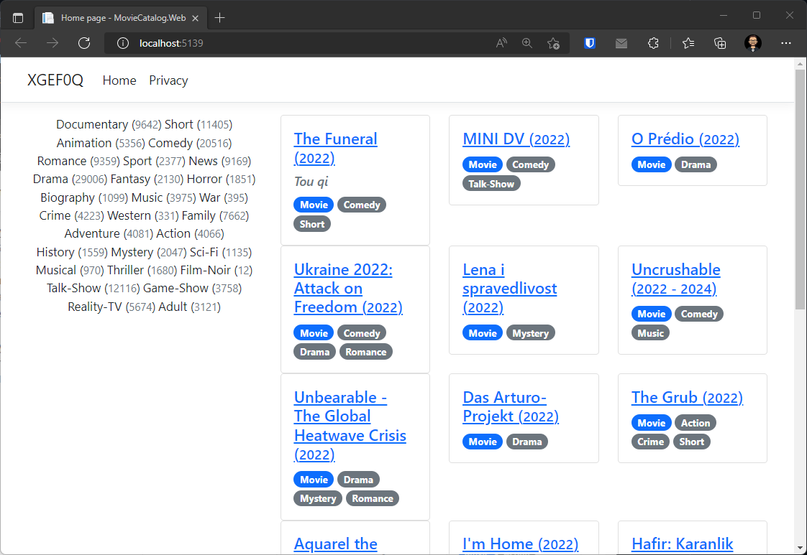
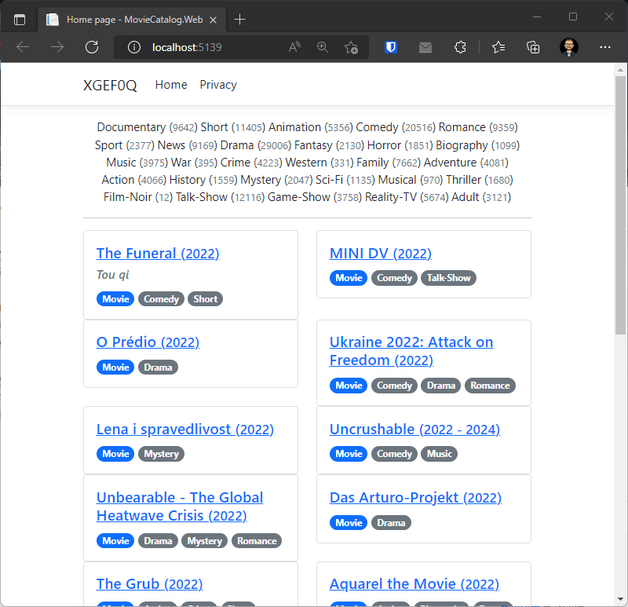

# Feladat 1: Előkészítés

Most is az [Entity Framework laboron](../ef) készült adatmodellt fogjuk hasznosítani, hogy egy szerveroldalon renderelt webalkalmazást készítsünk ASP.NET Core-ban.

A [Blazor](https://docs.microsoft.com/en-us/aspnet/core/blazor/) komponensalapú keretrendszerben is van lehetőség szerveroldali renderelést végezni (többféle módon is). Ha érdekel az ASP.NET Core alapú webfejlesztés, ezt a labort Razor Pages használata helyett elvégezheted [Blazor Server](https://docs.microsoft.com/en-us/aspnet/core/blazor/hosting-models) segítségével is. Mivel ezt a technológiát részletesen nem tanultuk, így csak saját felelősségre vállalkozz így a feladatra! Ha nem akarsz kockáztatni, akkor nyugodtan maradj a már tanult Razor Pages alapú megközelítésnél! Ebben az esetben egy plusz jegyet kapsz az elégségest követően, de ezzel kapcsolatos esetleges fennakadásaidra önállóan kell megoldást találnod.

1. Hozz létre egy új C# nyelvű ASP.NET Core Web App (nem Web API) típusú projektet `MovieCatalog.Web` néven

    - Érdemes a laborgépeken kikapcsolni a *Configure for HTTPS lehetőséget*, mert a gépekre nem biztos, hogy tudjuk telepíteni a fejlesztéshez szükséges tanúsítványt. Saját gépeken ilyen probléma nem lesz, viszont az első indításkor el kell fogadni a tanúsítvány telepítését a kettő megjelenő ablakban.
    - .NET verzió: 8.0
    - Minden extra opció legyen kikapcsolva
    - *Authentication type* is *None* legyen
    
1. Töltsd le az alábbi DACPAC fájlt [innen](../webapi/data/imdbtitles_sample.dacpac). Ami egy hordozható export formátum MS SQL Server adatbázisok számára.

1. Csatlakozz egy LocalDB példányhoz a Visual Studio-s SQL Server Object Explorerben. A **Databases** mappán jobbklikk, majd válaszd *Publish Data-tier Application* opciót. Tallózd be a DACPAC fájlt és add meg adatbázis nevét, ami legyen a neptun kódod, majd mehet a [*Publish*](https://learn.microsoft.com/en-us/sql/ssdt/extract-publish-and-register-dacpac-files?view=sql-server-ver16#publish-data-tier-application). Ezzel telepíted a DACPAC fájlban lévő objektumokat, adatokat az adatbázis kiszolgálóra. Import után érdemes ráfrissíteni az adatbázisok listájára.

1. Add hozzá a fejlesztésre szánt kapcsolódási stringet az *appsettings.Development.json* fájlhoz (az *appsettings.json* "mögött" bújik meg). A beállítás neve is legyen a neptun kódod (pontosabban *DBneptunkód*).

    ``` JSON
    {
        "ConnectionStrings": {
            "DB<neptun kódra írj át>": "Server=(localdb)\\mssqllocaldb;Database=<neptun kódra írj át>;Trusted_Connection=True;MultipleActiveResultSets=true"
        },
        "Logging": { "..." }
    }
    ```

    - **Ha már korábbról van ugyanilyen névvel adatbázisunk, azt érdemes törölni, vagy más néven elnevezni a connection stringben az adatbázist, hogy ne akadjanak össze.**

1. Add hozzá a projekthez a *Microsoft.EntityFrameworkCore.SqlServer* (verzió: 8.0.20) NuGet csomagot

1. Add hozzá az előre elkészített entitásmodell és adatbázis kontextus fájlokat a projektedhez egy új Entities könyvtárba. Ehhez érdemes [letölteni ezt a git branchet](https://github.com/VIAUBC01/labor-leirasok/archive/refs/heads/razor-snippets.zip). A DACPAC adatbázis sémája megfelel az EF modellnek, és mivel nem módosítunk rajta, így EF migrációval ezen mérés keretében nem kell foglalkozni.

*Figyelem!* A *Pages* mappában található fájlok kódrészleteket tartalmaznak, ezek tartalmát használd fel és ne csak felülírd a projektbeli *Pages* mappát!

1. Regisztráld az adatbázis kontextust `Entities/MovieCatalogDbContext.cs` a DI rendszerbe. (_Program.cs_) 

1. Add hozzá a projekthez az előkészített segédosztályokat az *Utils*, illetve *Exceptions* mappába. 

1. Add hozzá a projekthez az előkészített `MovieCatalogDataService` és az `IMovieCatalogDataService` típusokat a *Services* mappába.

1. Regisztráld az `IMovieCatalogDataService`-t a DI rendszerbe [*scoped* életciklussal](https://learn.microsoft.com/en-us/dotnet/api/microsoft.extensions.dependencyinjection.servicecollectionserviceextensions.addscoped). (Program.cs)

# Általános szabályok

- `PageModel` leszármazott nem használhatja adatbáziselérésre a kontextust, csak a *Services* található `IMovieCatalogDataService` interfész műveleteit (közvetetten tehát a `MovieCatalogDataService` függvényeit).
- `PageModel` leszármazott közvetlenül nem példányosíthatja a `MovieCatalogDataService`-t, csak konstruktoron keresztül kaphatja `IMovieCatalogDataService`-ként.
- A `MovieCatalogDataService` osztályban minden szükséges metódus **váza** megtalálható, de nem minden metódus van implementálva, a hiányzókat implementálnod kell legkésőbb a kapcsolódó feladat megoldásakor.
    
# Önálló Feladat

1. Módosítsd az oldal felső menüsorában a *Home* menüponttól balra eső első, főoldalra mutató menüpont feliratát a neptunkódodra.

1. Módosítsd a főoldal szerkezetét az alábbi részfeladatoknak megfelelően. A kinézet kialakításához felhasználhatod a letöltött *Pages* mappában található razor leírót (*Pages/Index.static.cshtml*). Kipróbáláshoz a *Pages/Index.cshtml*-ed cseréld le a fájl tartalmára.

*Figyelem!* Ez a fájl nem használ semmilyen modelladatot, csak statikus random generált értékeket. Le kell cserélned a ciklusokat és a statikus szövegeket, hogy modelladatot/adatbázisadatot használjanak. A linkek (`<a>`) célcíme egyelőre nem fontos.

1. A kezdőoldalon, bal oldalon jelenjenek meg az adatbázisban tárolt műfajok ABC szerinti sorrendben egy szófelhőben, minden műfaj önálló felirat. A felirat tartalmazza, hogy hány mű tartozik az adott műfajba. Mivel minden műfajt le kell kérdezni, a rendezés itt mehet memóriában is. Kapcsolódó `IMovieCatalogDataService` művelet a `GetGenresWithTitleCountsAsync`.

1. Jobb oldalon a művek szűrt, rendezett listája látható. A filmek alábbi adatai láthatók:

    - címe, 
    - eredeti címe, ha nem egyezik meg a címmel,
    - megjelenés és zárás éve - ha 2015 a megjelenés éve és 2020 a zárás éve, akkor (2015 - 2020) alakban; ha viszont nincs zárás éve, akkor (2015) alakban
    - típusa,
    - műfajai

Az alábbi szabályok szerint szűrd a műveket:

- a `MovieCatalogDataService.GetTitlesAsync` függvényét kell használnod
- csak film (`Movie`) típus
- legfeljebb idei, tehát a jövőre tervezettek kiszűrve
- megjelenési év szerint csökkenően rendezve az első 20 darab
- a szűrés nem kell, hogy változtassa a műfajok felhőjében a számosságokat

## Végső kinézet különböző méretek esetén






# Általános tudnivalók, megjegyzések, tippek

- Az oldalba hivatkozva megtalálhatod a Bootstrap és jQuery adott verzióját. Értelemszerűen a stílusozást érdemes így a Bootstrappel végezni, a jQuery is szabadon használható. Ha verzióproblémát tapasztalsz valamelyik Bootstrap funkció/komponens használatakor, [letöltheted a Bootstrap oldaláról](https://getbootstrap.com/) az előre fordított verziót és felülírhatod a jelenleg használtat a *wwwroot/lib/bootstrap* mappában. [Ugyanezt megteheted a jQuery-vel is](https://jquery.com/download/), bár ott verziókompatibilitási problémák ritkábbak, ugyanis nem fejlesztik annyira aktívan.
- Nem szükséges szépnek/ergonomikusnak lennie az oldalnak, de mindenképpen láthatónak kell lennie, hogy mely elemek tartoznak össze.
- Navigációhoz nem érdemes használni a `href` attribútumot, helyette az [asp-page Tag Helpert és társait](https://docs.microsoft.com/en-us/aspnet/core/mvc/views/tag-helpers/built-in/anchor-tag-helper) (pl: `asp-page-handler`, `asp-route-parameterNev`, `asp-all-route-data`) érdemes használni.
- Modell tulajdonság adatkötéséhez használható a `BindProperty` és kapcsolódó attribútumok. GET-es kérések esetén az adatkötést explicit engedélyezni kell, pl.: `[BindProperty(SupportsGet = true)]`. Használható a teljes page fölött a `[BindProperties]` attribútum is, ekkor a nem kötendő tulajdonságokat `[BindNever]` attribútummal kell ellátni.
- A Razor kódból a PageModel objektumot a `@Model` tulajdonságon keresztül érjük el.
- Tetszőleges további objektumokat, szolgáltatásokat készíthetsz a feladatok megoldásához.
- Ha egy page nem Razor Page (pl. a Layout oldal), használható az `@inject` direktíva objektum injektálására. Minden más esetben javasolt a normál konstruktor injektálás.
    ``` HTML
    @inject MovieCatalog.Data.IMovieCatalogDataService DataService
    ```
- Komplex, referencia típusú (pl. `PagedResult<>`) változókat, propertyket, ha a `null` értéknek nincs értelme, akkor érdemes nem `null` értékre inicializálni. Ha ilyenkor nem akarunk/kell konstruktorhívásokkal állandóan új üres példányt létrehozni, nézzük meg, van-e a típusnak `Empty` statikus tagja ([például a beépített kollekcióknak általában van](https://learn.microsoft.com/en-us/dotnet/api/system.linq.enumerable.empty?view=net-8.0)) és használjuk azt.
- Megkönnyítheti a fejlesztést a [Hot Reload funkció](https://learn.microsoft.com/en-us/visualstudio/debugger/hot-reload?view=vs-2022), mely lehetővé teszi, hogy a kódváltoztatásaink sokkal gyorsabban (teljes újraindítás nélkül) érvényre jussanak.
- Az adatbázis sémája szinte megegyezik az EF laboron megismerttel, kivéve:

    - új index a *Title.StartYear* oszlopra
    - az új művek azonosítóját az adatbázis osztja ki  

- Sokszor körülményesebb az IIS Express-en történő debuggolás, helyette használhatod közvetlenül a Kestrel szervert is. Ehhez a zöld play gomb melletti menüben a projekt nevét viselő lehetőséget válaszd ki! Ezután indításkor az *IIS Express* tálcaikon helyett egy konzolalkalmazás indul el, ami hasznos üzeneteket is kiír a konzolra.
- Előfordulhat, ha például nagy az adatbázis, és nem indexelt oszlopokra szűrünk/rendezünk, hogy timeout-ra futunk. Ilyenkor első körben próbálkozzunk más szűrési/rendezési beállításokkal.

## Beadandó tesztesetek

- Főoldal megjelenítve, minden főbb rész látható. A teljes címsor és menüsor is. Látható egy olyan mű is, aminek van végdátuma / zárás éve, illetve olyan is, aminek nem egyezik az elsődleges címe az eredeti címével (adatbázisban módosíts, ha alapból nem jelennének meg ilyenek).

## Következő feladatok

Ezekkel folytathatod:

- [Mű szerkesztő oldala](Feladat-2.md)
- [Lapozás és rendezés](Feladat-3.md)

# Bónusz feladat

Plusz egy jegyért (ha az elégséges enélkül is megvan) **mindkét** alábbi feladatot oldd meg:

1. A műfajfelhőben minél több mű van egy műfajban,  legyen annál nagyobb a betűméret. A legkevesebb elemet tartalmazó műfaj mérete 100% (az alapértelmezett méret, `1em`), a legtöbbet tartalmazó 200% (`2em`), a kettő között lineáris az eloszlás. Mivel dinamikusan számított az érték, most ezt megadhatjuk a `style` attribútumban.

Példa: ha a legtöbb elemet tartalmazó műfajban 250 elem van, a legkevesebb elemet tartalmazóban 100, akkor 137 elemet tartalmazó műfaj esetén a méret:

- 1 + (137 - 100)/(250 - 100) = 1,2466667 => `1.247em`

Figyelem! Érdemes nem túl sok tizedes értéket meghagyni, illetve mindenképp tizedespont kell (vessző nem jó). Erre használható például a `float.ToString("N3", CultureInfo.InvariantCulture)` ([ToString()](https://learn.microsoft.com/en-us/dotnet/api/system.single.tostring?view=net-8.0#system-single-tostring(system-string-system-iformatprovider))).

2. A művek típusa emberi szövegként jelenjen meg, ne felsorolt típusként, pl. *TvSeries* => *TV series*. A kipróbáláshoz ideiglenesen kommentezd ki a műtípusra vonatkozó szűrést.
