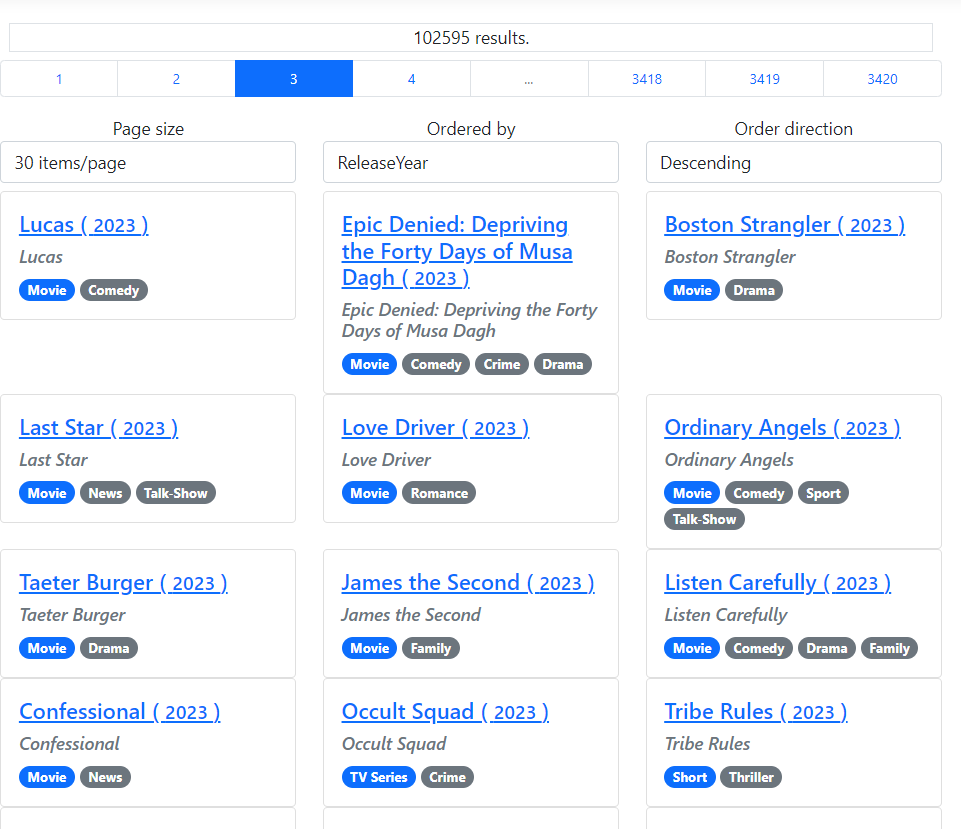

# Feladat 3: Lapozás & rendezés

## Specifikáció

### Lapozás
A lapozást és rendezést a kezdőoldalon (*Index*) kell megvalósítani, minden paraméter URL-ben utazzon! A lapozáshoz az oldal tetején és/vagy alján kell szerepelnie egy lapozósávnak az alábbinak megfelelően:

- Legyen látható az összes találat száma.
- Legyen választható az aktuális oldalméret egy legördülő menüben, lehetséges értékei: 10, 20, 30, 60, 120. Az alapérték 20. Újratöltés után mindig a megfelelő elem legyen kiválasztva!
- Bármelyik lapozási beállítás változtatásakor az oldal töltődjön újra az első oldalon, az új oldalmérettel! Ehhez a JavaScriptes `onchange` eseménykezelőt lehet például használni. Egyszerű megoldás definiálni egy űrlapot, amiben a `select` szerepel a megfelelő paraméterekkel, valamint egy `hidden` `input`ot 1-es `PageNumber` értékkel. Ezután már csak a `select` `onchange`-ben kell megfelelően elsütni a `form` `submit` eseményét.
- Legyenek láthatók a lehetséges oldalszámok egy oldalválasztóval az alábbinak megfelelően:
    - Az első 3 oldal mindig legyen látható (ha van).
    - Az aktuális plusz/mínusz 1 oldal mindig legyen látható (ha van).
    - Az utolsó 3 oldal mindig legyen látható (ha van).
    - A további oldalakat három pont (...) jelzi, ahol kimaradás történik.
    - A ...-on kívüli elemekre kattintva a megfelelő oldal töltődik be. Fontos, hogy a `PageSize` paraméter értéke lapozáskor megmarad!
- Az oldalválasztóhoz javasolt (nem kötelező) a [Bootstrap Pagination](https://getbootstrap.com/docs/5.0/components/pagination/) komponenst használni.
- Az oldalszám technikailag az adatrétegből 0-tól indul, de a felületen/URL-ben 1-től induljon, tehát az eltolást a megfelelő helyeken alkalmazd!
- Ha a lapozási paraméterek nincsenek az URL-ben, irányítsd át a kérést egy olyan címre, ami már tartalmazza a paramétereket, így a felhasználó mindig tudja a címből, hogy mi a lapozás/rendezés állapota.

### Rendezés

- A rendezéshez két legördülő tartozik, amik bármelyikének változásának hatására az oldal az új paraméterekkel újratöltődik:
    - a rendezési mező, mellyel a `TitleSort` lehetséges értékei közül lehet választani, illetve
    - a rendezés iránya, mellyel a `SortDescending` értékei közül lehet választani. A `true` érték _Descending_, a `false` _Ascending_ feliratként jelenik meg.
- A rendezés megadásakor az oldalméret nem változik, az oldalszám viszont 1-re állítódik.

## Megvalósítás lépései

Nem kötelező így csinálni, de egy lehetséges megoldás lépései a következők.

1. Vegyél fel 4 property-t az `IndexModel`-be az alábbi nevekkel és alapértelmezett értékkel:

    - `PageSize`, alapértelmezett értéke 20
    - `PageNumber`, alapértelmezett értéke 1
    - `TitleSort`, alapértelmezett értéke `TitleSort.ReleaseYear`
    - `SortDescending`, alapértelmezett értéke `true`

    Mindegyik property automatikusan állítódjon be a HTTP kérés (query string) alapján (`BindProperty` attribútum) [GET kérés esetén is](https://learn.microsoft.com/en-us/aspnet/core/mvc/models/model-binding?view=aspnetcore-8.0#model-binding-for-http-get-requests-1) (`SupportsGet`).

1. A `GetTitlesAsync` hívását paraméterezd fel a 4 property alapján.

    Próbáld ki, hogy a böngésző címsorában kiegészítve a címet, tudod-e vezérelni az lapozást. Például a 
    ```
    /?SortDescending=False&PageSize=30&TitleSort=ReleaseYear&PageNumber=3
    ```
    cím megfelelően paraméterezi-e a hívást és a kért adatok jelennek-e meg.

1. Valósítsd meg az `OnGet` elején a specifikációnak megfelelő átirányítást, tehát ha a cím csak simán a gyökércím, akkor irányítson el a 
    ```
    /?PageSize=20&PageNumber=1& TitleSort=ReleaseYear&SortDescending=True
    ```
    címre. A kérés query string értékei a   `Request.QueryString` propertyből kérdezhetők     le. Az átirányítás végezhető a  `RedirectToPage` függvény [hívásával](https://learn.microsoft.com/en-us/dotnet/api/microsoft.aspnetcore.mvc.razorpages.pagebase.redirecttopage?view=aspnetcore-8.0#microsoft-aspnetcore-mvc-razorpages-pagebase-redirecttopage(system-string-system-object)). Vigyázz, mert  ha az átirányítás nem jó, könnyen "végtelen  ciklus"-ba kerülhetsz. Az átirányítás miatt az `OnGet` visszatérési értéke `Task<ActionResult>`-ra kell változzon, emiatt minden végrehajtási ágon visszatérési értéket kell adni. A **nem** átirányítós ágon ilyenkor a `Page()` hívás visszatérési értéke legyen egyben az `OnGet` visszatérési értéke is.

1. Vegyél fel a 3 legördülő menühöz egy-egy a legördülő menüben szereplő opciókat leíró `SelectItems[]` típusú property-t az `IndexModel`-be (a `PageNumber` nem legördülő menüből jön!). A tömbben a specifikációnak megfelelő opciók szerepeljenek. Figyelj, hogy a példány létrehozásnál [a feliratot, az adatkötött property-nek beállítandó értéket és az alapértelmezetten kiválasztott elemet](https://learn.microsoft.com/en-us/dotnet/api/microsoft.aspnetcore.mvc.rendering.selectlistitem.-ctor?view=aspnetcore-8.0#microsoft-aspnetcore-mvc-rendering-selectlistitem-ctor(system-string-system-string-system-boolean)) is megfelelően töltsd ki.

1. Vegyél fel a látható oldalszámok felsorolására egy property-t az `IndexModelbe`. Egy lehetséges megadása az alábbi (feltételezve, hogy a `GetTitlesAsync` által visszaadott művek a `Titles` property-be kerülnek):

    ```csharp
    public IReadOnlyList<int> PageNumberOptions =>
        new[]{
                1, 2, 3, PageNumber - 1, PageNumber,    PageNumber + 1, Titles.LastPageNumber -    1,
                Titles.LastPageNumber, Titles.  LastPageNumber + 1
            }
            .Where(i => i > 0 && i <= Titles.   LastPageNumber + 1)
            .Distinct()
            .OrderBy(i => i)
            .ToArray();
    ```

1. A lapozást vezérlő felületrész egy lehetséges megvalósítását a letöltött *Pages* mappánan megtalálod (*Index.paging.cshtml*). Ebben egy `<nav>` tag található, amit a listázó felület `<div class="row">`-ja fölé helyezhetsz el. Ha ezt használod, ellenőrizd, hogy a razor kódban található modellhivatkozások a te saját modellednek megfelelő property nevekre hivatkoznak-e, például a művek szűrt-lapozott listáját a `Titles` property tárolja-e. Ha nem, írd át a hivatkozást megfelelő névre. A kód értelmezése ilyenkor a te feladatod, némi segítség található lentebb.

1. Írd át az összes elem számát megjelenítő részt, hogy tényleg az összes elem számát jelenítse meg.

1. Kösd be a 3 legördülő menünek az opcióikat, azaz a korábbi `SelectItems[]` típusú property-ket. Kösd be a lehetséges oldalszámokat megadó propertyt is a konstans lista helyére, hogy ne csak az első pár oldal opciója jelenjen meg.

## Végső kinézet

Teszt URL:
```
/?SortDescending=True&TitleSort=ReleaseYear&PageSize=30&PageNumber=3
```



## Magyarázat a minta razor felülethez

A 3 legördülő és a lapváltó gomboknak mind-mind állítgatniuk a nekik megfelelő query string paramétert, **de** közben a többi query string paraméterre is figyelniük kell, vannak amiket meg kell tartani, vannak amiket alapértelmezett értékre kell átírni.

A paraméterek kölcsönös megtartásához (pl. lapozáskor az oldalméret és rendezés ne változzon; rendezéskor az oldalméret ne változzon) navigációkor használhatjuk az `asp-route-all-data` *Tag Helper*-t, aminek átadhatjuk az aktuális query paraméterek szótárát; ezután felülírhatjuk a további értékeket:

```html
 <a class="page-link"
     asp-all-route-data="Request.Query.ToDictionary(v => v.Key, v => v.Value?.ToString())"
     asp-route-PageNumber="@i">
     @i
 </a>
```

Ugyanez a megoldás űrlapokon nem használható, ott az aktuális `QueryString` értéket kell feldolgozni, így például a [szűrési feltételeket](Feladat-4.md) is meg tudjuk tartani:
    
```html
<form method="get">
    <select asp-for="PageSize" class="..." onchange="..." asp-items="@(...)">
    </select>
    @foreach (var (key, value) in Request.Query.Where(
        q => q.Key != nameof(Model.TitleSort) // ezt azért szűrjük ki, mert a select-ben állítjuk ugyanezen az űrlapon
        && q.Key != nameof(Model.PageNumber) // ezt pedig azért, mert rejtett mezőben 1-re állítjuk, hogy oldalméret váltásakor az első oldalra megyünk
        ))
    {
        <input type="hidden" name="@key" value="@value" />
    }
    <input type="hidden" asp-for="PageNumber" value="1" />
</form>
```

## Beadandó tesztesetek

- Legalább két darab, különbözőképpen beállított lapozás. Szövegesen szerepeljen a képen az átállítás utáni teljes URL is.

## Következő feladatok

Ezekkel folytathatod:

- [Mű szerkesztő oldala](Feladat-2.md)
- [Szűrés](Feladat-4.md)
