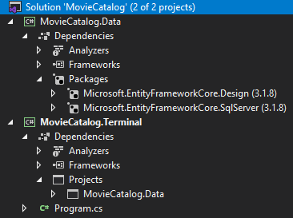
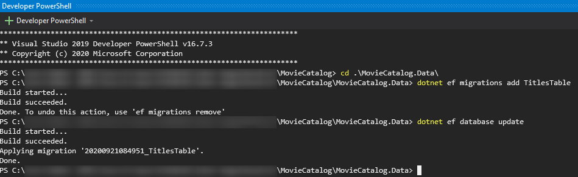

# 1. feladat

## Áttekintés

A készülő alkalmazásban az [IMDB által naponta frissített, publikus adatok](https://www.imdb.com/interfaces/)
felhasználásával fogjuk filmek adatait kezelni. Fontos, hogy ezt az adathalmazt saját, tanulási célra szabadon
használhatjuk, minden más célra kifejezett engedélyt kell kérni.

Az elkészítendő alkalmazásunk egy osztálykönyvtár lesz, amit más kódból (pl. egy REST API-t szolgáltató web API
projektből vagy egy szerveroldali renderelést használó projektből) szeretnénk majd elérni. Mivel a kódunk
osztálykönyvtár, önmagában nem is futtatható, hanem egy `.dll` fájlként csak a kódot tartalmazza, amit más, futó .NET
alkalmazásból el tudunk majd érni.

Először létrehozzuk az osztálykönyvtárat, amiben az adatbázist reprezántáló `DbContext`-et, a táblákat reprezentáló
entitásokat fogjuk definiálni. Itt lesznek még a szükséges migrációk is, amelyeket az adatbázisunkon lefuttatva az
adatsémát a modellel szinkronba hozhatjuk. Az adatbázist code first módszertannal modellezzük, tehát először az
entitásokat fogjuk definiálni, aztán létrehozzuk a migrációkat, amiket végül lefuttatunk, így jön majd létre az
adatbázisban a modellünknek megfelelő séma.

Az osztálykönyvtárunkban található kódot nem tudjuk "csak úgy" futtatni, szükségünk lesz tehát valamilyen projektre, ami
képes a kód futtatására. Ehhez ugyanabban a solutionben fogunk létrehozni egy új konzolos alkalmazást.

### Emlékeztető

- Amikor az adatmodellt (C# entitásosztályokat) módosítjuk, új migrációt kell létrehozni, erre használhatjuk a következő
  parancsot:
    ```bash
    dotnet ef migrations add <migrációnév>
    ```
    - A `migrációnév`-nek egyedinek kell lennie, érdemes értelmes nevet adni neki, pl.
      `AddTotalCostColumnToProductOrder`.
- Az adatbázist a legújabb migrációra a következő paranccsal frissíthetjük:
    ```bash
    dotnet ef update database
    ```
- Ha egy migrációt elrontottunk vagy szeretnénk visszavonni, használjuk a következő parancsot:
    ```bash
    dotnet ef migrations remove
    ```
    - Ez a legutolsó migrációt törli. Ezután adjuk hozzá az új migrációt.
        - Ha a migrációt már alkalmaztuk az adatbázisra, előtte mindenképp futtassuk a következő parancsot:
            ```bash
            dotnet ef database update <migrációnév>
            ```
            - Ahol a `migrációnév` az **utolsó előtti** migráció, tehát eggyel korábbi, mint amit törölni szeretnénk.
              Ezzel az adatbázis az előző migráció hatását visszafordítja, ezután az utolsó migráció a fenti paranccsal
              törölhető.
- Ha maguk a migrációk rendben vannak, de az adatbázis adattartalmát törölni akarjuk (*kezdjük elölről*), hasznos a
  következő parancs:
    ```bash
    dotnet ef database update 0
    ```
    - Ez eldobja az összes migrációban érintett objektumot (pl. táblát), majd a következő paranccsal lefuttatjuk az
      összes migrációt:
        ```bash
        dotnet ef database update
        ```
    - Így már egy használható, de alaphelyzetben lévő adatbázist kapunk.
- Mivel a parancsokat a Visual Studiótól függetlenül futtatjuk, így minden parancsfuttatás előtt érdemes minden nem
  mentett fájlt elmenteni, vagy fordítani a solutiont.
- Alternatívaként használhatjuk
  a [PowerShell-alapú parancsokat](https://docs.microsoft.com/en-us/ef/core/cli/powershell) is a Visual Studio Package
  Manager Console-jából (PMC). Ilyenkor általában kevesebb paramétert kell megadnunk, mert azok a Visual Studio / PMC
  állapota alapján töltődnek.

Lássunk neki!

## Előkészületek

1. Telepítsük az [EF Core Global Tool](https://learn.microsoft.com/en-us/ef/core/cli/dotnet)-t.
    - Adjuk ki az alábbi parancsot egy tetszőleges parancssorban:
       ```bash
       dotnet tool install --global dotnet-ef --version 6.0.6
       ```
        - Ha bármilyen okból kifolyólag korábban már telepítve volt, az `install` parancsot `update`-re cserélve
          frissíthető a tool a legfrissebb stabil verzióra.
    - Ezzel használhatók lesznek a `dotnet ef` parancsok.
1. Hozzunk létre egy új .NET (.NET `6.0` verziójú, a későbbiekben is) C# osztálykönyvtárat (*Class Library*)
   `MovieCatalog.Data` néven, `MovieCatalog` solutionnel egy üres munkamappában!
1. Adjunk a solutionhöz egy új .NET C# konzol projektet is `MovieCatalog.Terminal` néven!
1. Töröljük a létrejött helyőrző fájlt (`Class1.cs`) az adatrétegprojektben!
1. Adjunk referenciát a konzolos projektből az adatrétegprojektre! Értelemszerűen így a konzolos projektből el fogjuk
   érni az adatréteg típusait és API-ját, fordítva viszont nem.
1. Adjunk referenciát a `Microsoft.Extensions.Hosting` NuGet-csomag `6.0.1`-es verziójára a `MovieCatalog.Terminal`
   projektből!
1. Adjunk referenciát a `Microsoft.EntityFrameworkCore.SqlServer` és a `Microsoft.EntityFrameworkCore.Design`
   NuGet-csomagok `6.0.35`-ös verziójára a `MovieCatalog.Data` projektből!
1. Állítsuk be a konzolos projektet Startup projektként, így az `F5` (_Start Debugging_) lenyomásakor ez fog elindulni.
   Ezzel a projekt neve félkövér lesz.

Ha mindent jól csináltunk, az alábbiakat kell látnunk a projektszerkezetben (a verziószámok nagyobbak lesznek):



## Alapinfrastruktúra kialakítása, tesztelése

1. Hozzunk létre egy új mappát az adatrétegben `Entities` néven, és adjuk hozzá a `Title` entitást:

```csharp
namespace MovieCatalog.Data.Entities
{
    public class Title
    {
        public int Id { get; set; }
        public string TConst => $"tt{Id.ToString().PadLeft(7, '0')}";
        public string PrimaryTitle { get; set; }
        
        public Title(string primaryTitle)
        {
            PrimaryTitle = primaryTitle;
        }
    }
}
```

- Láthatjuk, hogy a `TConst` mező számított érték, az IMDb elnevezési konvenciója alapján `tt1234567` formátumban van,
  de mi csak a számértéket tároljuk majd az adatbázisban.

2. Hozzunk létre egy új `DbContext` típust az adatrétegben `MovieCatalogDbContext` néven, az alábbi tartalommal:

```csharp
using Microsoft.EntityFrameworkCore;
using Microsoft.Extensions.Logging;
using MovieCatalog.Data.Entities;

namespace MovieCatalog.Data
{
    public class MovieCatalogDbContext : DbContext
    {
        public MovieCatalogDbContext(ILogger<MovieCatalogDbContext> logger
                                      ,DbContextOptions<MovieCatalogDbContext> options) : base(options)
        {
            Logger = logger;
        }

        private ILogger<MovieCatalogDbContext> Logger { get; }

        public DbSet<Title> Titles => Set<Title>();

        protected override void OnModelCreating(ModelBuilder modelBuilder)
        {
            modelBuilder.Entity<Title>(title =>
            {
                title.Property(t => t.Id).ValueGeneratedNever();
                title.Property(t => t.PrimaryTitle)
                    .HasMaxLength(500);
                title.HasIndex(t => t.PrimaryTitle);
            });
        }
    }
}
```

A `Title` entitásunkon konfiguráltuk az `Id` és `PrimaryTitle` tulajdonságokat (adatbázistábla-mezőket):

- Az `Id` nevű mező konvenció
  szerint [adatbázis által generált](https://docs.microsoft.com/en-us/ef/core/modeling/generated-properties?tabs=data-annotations#primary-keys),
  mi most viszont kézzel szeretnénk megadni (az IMDb-ből fog érkezni).
- A címben gyakran szeretnénk keresni, ezért indexeljük.
    - Az EF alapértelmezetten `NVARCHAR(max)` típusú
      stringmezőket [hoz nekünk létre](https://docs.microsoft.com/en-us/ef/core/modeling/entity-properties?tabs=data-annotations%2Cwithout-nrt#column-data-types).
    - Az indexelés SQL Serveren csak bajosan alkalmazható `VARCHAR(max)`, azaz nem korlátozott hosszúságú méretű
      mezőkön (ugyanis azok nem a rekordban, hanem a rekordhoz hivatkozva tárolódnak).
      Ezért be kell állítanunk a maximális címhosszt, és vannak igen hosszú című filmek/videók.
- Az EF alapértelmezett konvencióként a mezők
  nullozhatóságát [a leképzendő property típusának nullozhatósága adja](https://docs.microsoft.com/en-us/ef/core/modeling/entity-properties?tabs=data-annotations%2Cwithout-nrt#conventions).
  A `string` típus .NET 6-os verzió óta alapértelmezetten nem nullozhatóként van számon tartva, így az adatbázisbeli
  kötelezőséget külön nem kell beállítanunk.

3. A migráció létrehozásához szükséges a CLI tudtára adni, hogy milyen adatbázismotorra készítse a migrációkat (más
   migráció készül pl. SQL Serverre mint SQLite-ra). Hozzunk létre egy `Design` nevű mappát a `Data` projektben, benne
   az alábbi factory osztályt, ami egy `DbContext`-et tud gyártani nekünk. A factoryt "éles" futás közben nem használja
   semmi, kizárólag a migrációs fájlok elkészítése miatt szükséges most nekünk. A connection stringet az éles alkalmazás
   nem ezt a factoryt használva fogja átadni. Láthatjuk, hogy ez az osztály nem is használható (szabályosan) más
   szerelvényekből, mert `internal` láthatóságú. Értelemszerűen a connection string cserélendő, ha nem LocalDB-n készül
   az alkalmazás, de alapértelmezetten és a laborokon ez teljesen megfelelő.

```csharp
using Microsoft.EntityFrameworkCore;
using Microsoft.EntityFrameworkCore.Design;
using Microsoft.Extensions.Logging;

namespace MovieCatalog.Data.Design
{
    internal class MovieCatalogDesignTimeDbContextFactory : IDesignTimeDbContextFactory<MovieCatalogDbContext>
    {
        public MovieCatalogDbContext CreateDbContext(string[] args) =>
            new(new Logger<MovieCatalogDbContext>(new LoggerFactory()), 
                new DbContextOptionsBuilder<MovieCatalogDbContext>()
                    .UseSqlServer(@"Server=(localdb)\mssqllocaldb;Database=MovieCatalog")
                    .Options
                );
    }
}
```

4. Készítsünk migrációt, majd futtassuk le azt az adatbázison! A terminálban / a PowerShell-ablakban adjuk ki az alábbi
   parancsokat (Visual Studióban és Code-ban is a `Ctrl+Ö` billentyűkombináció nyit egy Developer PowerShell-ablakot) a
   **`MovieCatalog.Data` projekt mappájából**:

- ```bash
  dotnet ef migrations add TitlesTable
  ```
- ```bash
  dotnet ef database update
  ```



5. Készítsük el a konzolalkalmazást reprezentáló osztályt a `Terminal` projektben.

```csharp
using Microsoft.Extensions.Hosting;
using Microsoft.Extensions.Logging;
using MovieCatalog.Data;
using System.Threading;
using System.Threading.Tasks;

namespace MovieCatalog.Terminal
{
    public class TestConsole : IHostedService
    {
        public TestConsole(MovieCatalogDbContext dbContext, IHost host, ILogger<TestConsole> logger)
        {
            DbContext = dbContext;
            Host = host;
            Logger = logger;
        }

        private MovieCatalogDbContext DbContext { get; }
        private IHost Host { get; }
        private ILogger<TestConsole> Logger { get; }

        public async Task StartAsync(CancellationToken cancellationToken)
        {
            Logger.LogInformation("Started.");
            
            // TODO: Ide jön az alkalmazás kódja.

            await Host.StopAsync(cancellationToken);
        }

        public Task StopAsync(CancellationToken cancellationToken)
        {
            Logger.LogInformation("Stopping...");
            return Task.CompletedTask;
        }
    }
}
```

- Láthatjuk, hogy a `TestConsole` osztály számít rá, hogy kapni fog *valahonnan* egy `MovieCatalogDbContext` példányt,
  tehát felkészültünk arra, hogy a rendszer dependency injectiont használ.
- Érdekesség a `cancellationToken` névre hallgató paraméter. Ez egy aktiválható token, amit átpasszolhatunk további
  aszinkron kéréseknek, pl. a fenti `StopAsync`-nak. Ez azt eredményezi, hogy ezek a hívások megvizsgálatják, valaki "
  nyomott-e mégsemet" a láncban feljebb, és ha igen, akkor abbahagyják a futást. Nem szükséges használni, de szép,
  szofisztikált pattern, jó tudni róla. Ha egy függvényt írunk, ami `CancellationToken`-t kap, akkor a tokent illik
  továbbpasszolni azt minden általunk hívott függvénynek (ha van olyan változata, ami fogad ilyen paramétert).

6. Készítsük el a konzolt kiszolgáló részt az alkalmazásban. A legelegánsabb megoldás az ASP.NET-tel analóg módon egy
   `GenericHostBuilder` osztály segítségével elkészíteni a hosztkészítő objektumot, majd az megépíteni és elindítani.
   Cseréljük le a `Program.cs` fájl teljes tartalmát az alábbira:

```csharp
using Microsoft.EntityFrameworkCore;
using Microsoft.Extensions.DependencyInjection;
using Microsoft.Extensions.Hosting;
using Microsoft.Extensions.Logging;
using MovieCatalog.Data;
using MovieCatalog.Terminal;

using IHost host = Host.CreateDefaultBuilder(args)
    .ConfigureServices((_, services) =>
        services.AddDbContext<MovieCatalogDbContext>(o => 
                    o.UseSqlServer(@"Server=(localdb)\mssqllocaldb;Database=MovieCatalog"))
                .AddHostedService<TestConsole>())
    .ConfigureLogging(l => l.AddFilter("Microsoft.EntityFrameworkCore", LogLevel.Warning))
    .Build();

await host.RunAsync();
```

A fenti indítási módszer analóg a *Háttéralkalmazások*ból tanult indítási móddal az ASP.NET Core kapcsán, a kivétel az
indítás módjában rejlik: itt most nem egy HTTP-t kiszolgálni képes hosztot, hanem "csak" egy konzolalkalmazást indítunk.

💡 Ha meg akarjuk nézni az EF által generált SQL-t, állítsuk át a naplózási szintet a `ConfigureLogging` hívásban
`LogLevel.Information`-re.

## Beadandó

Szúrj be egy rekordot a `Titles` táblába a terminálalkalmazásból, melyben a cím a Neptun-kódod!Másold be vagy készíts
képernyőképet az ezt megvalósító kódrészletről, valamint igazold annak a tényét, hogy a rekord beszúrásra került az
alábbi két módszerrel (mindkettővel!):

- SQL-alapú megoldással (pl. *SQL Server Object Explorer*ben futtatott lekérdezéssel), ÉS
- a konzolalkalmazásban történő újbóli lekérdezéssel, a konzolra történő kiírással (a `Logger`-példányra történő
  `LogInformation()`-hívással)!

## Következő feladat

Folytasd a [következő feladattal](Feladat-2.md).
