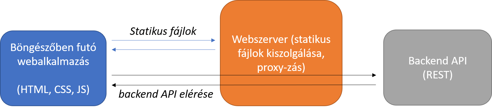

# Preact Mérés

Ennek a labornak a célja a Preact könyvtár használatának gyakorlása. 

Az alkalmazás a múlt laboron elkészített Twitter szervert fogja használni, amivel rövid szöveges üzeneteket (tweeteket) tudunk elküldeni, lekérdezni. 

Mit kell tudni ehhez a laborhoz?
* JavaScript és TypeScript alapok.
* A Preact könyvtár működése és a React alapfogalmainak ismerete.

A twitter szerver, amely a REST API-t biztosítja a `server` alkönyvtárban található. A [`server.md`](server.md) fájl leírja, hogyan tudjuk a szervert futtatni. Készítsük elő a szervert, majd indítsuk el, mielőtt elkezdjük a kliens fejlesztését. 

## Beadandó
1. A kliens forráskódja, a `node_modules` mappa nélkül!!!
1. Jegyzőkönyv PDF formátumban
  * Tartalmazza a hallgató adatait (név, neptun kód), dátumot
  * A feladatleírásban pontosan szerepel, hogy miről kell írni, vagy képernyőképet készíteni a jegyzőkönyvben. Amit külön nem említünk, arról nem kell írni.

## Architektúra

* A backend alkalmazás a korábbi laboron elkészített twitter szerver (`localhost:3000`)
* A böngészőben futó webalkalmazást Preact segítségével készítjük el
* Fejlesztés során a Vite build szervert használunk (`localhost:5173`)
* Proxy beállítással a `/api` útvonalú kérések a backend felé továbbítódnak

További megfontolások:
1. Preact komponensek kezelik a felhasználói felületet
2. HTTP kérések a backend felé a `fetch` API-val
3. Adatmegjelenítés és kötés JSX szintaxissal

Ha sikerült [elindítani a szerver alkalmazás](server.md)t, [kezdjük a kliens alkalmazással](client.md).