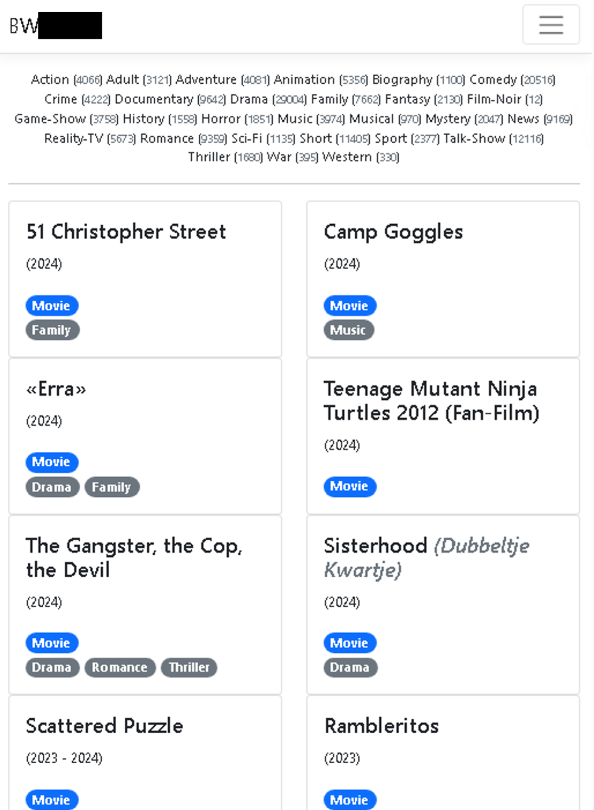

# Előkészítés

Szokás szerint 0-ról indulunk, az előző két laboron elkezdett filmkatalógushoz készítünk most egy szerveroldali renderelést (Razor Pages) használó weboldalt.

ASP.NET Core segítségével a [Blazor](https://docs.microsoft.com/en-us/aspnet/core/blazor/) komponensalapú keretrendszerben is van lehetőség szerveroldali renderelést végezni (többféle módon is). Ha érdekel az ASP.NET Core alapú webfejlesztés, ezt a labort Razor Pages használata helyett elvégezheted [Blazor Server](https://docs.microsoft.com/en-us/aspnet/core/blazor/hosting-models) segítségével is. Mivel ezt a technológiát részletesen nem tanultuk, így csak saját felelősségre vállalkozz így a feladatra! Ha nem akarsz kockáztatni, akkor nyugodtan maradj a már tanult Razor Pages alapú megközelítésnél! Ebben az esetben egy plusz jegyet kapsz az elégségest követően, de ezzel kapcsolatos esetleges fennakadásaidra önállóan kell megoldást találnod.

1. Hozz létre ismét egy új ASP.NET Core Web Application típusú alkalmazást `MovieCatalog.Web` néven, most az alábbi beállításokkal (ill. alapbeállításokkal, az elérhető legfrissebb .NET verziót használva):
  
  
  **Érdemes a laborgépeken kikapcsolni a "Configure for HTTPS" lehetőséget, mert a gépekre nem tudjuk telepíteni a fejlesztéshez szükséges tanúsítványt.** Saját gépeken ilyen probléma nem lesz, viszont az első indításkor el kell fogadni a tanúsítvány telepítését a kettő megjelenő ablakban.
1. Állítsd be, hogy a kultúra-invariáns formázási beállítások lépjenek érvényre az alkalmazásban! Ez elsősorban a float-ok megfelelő formázásához szükséges (tizedesvessző helyett tizedespont használata). Ehhez a Startup.Configure metódus elején állítsd ezt be az alábbi módon:
    ``` C#
    using System.Globalization;

    //...

    public void Configure(IApplicationBuilder app, IWebHostEnvironment env)
    {
        CultureInfo.DefaultThreadCurrentCulture = CultureInfo.DefaultThreadCurrentUICulture = CultureInfo.InvariantCulture;
        // ...
    ```
    
    Az előkészítés további lépései teljesen megegyeznek az előző labor elején elvégzett lépésekkel, ezek röviden:

1. Add hozzá a `MovieCatalog.Data` NuGet csomag legfrissebb verzióját a projekthez!
1. Használd az `IHost.MigrateAndSeedDataAsync()` metódust a séma elkészítéséhez és adatok betöltéséhez a `Main` függvényben! A `Main` visszatérése `void` helyett `async Task` legyen!
1. Add hozzá a `MovieCatalog` kulcsú kapcsolódási karakterláncot az `appsettings.Development.json` fájl ConnectionStrings tulajdonságához:
    ``` 
    "MovieCatalog": "Server=(localdb)\\mssqllocaldb;Database=MovieCatalog;Trusted_Connection=True;MultipleActiveResultSets=true"
    ```
1. Az adatszolgáltatást és adatbázis kontextust add hozzá a DI konténerhez:
    ``` C#
    services.AddMovieDataService()
            .AddDbContext<MovieCatalogDbContext>(options =>
                options.UseSqlServer(Configuration.GetConnectionString("MovieCatalog")));
    ```

# Feladat 1.

1. A kezdőoldalon, bal oldalon jelenjenek meg a műfajok ABC szerinti sorrendben egy szófelhőben, minden műfaj önálló link (az útvonal egyelőre mindegy). Minél több mű van egy műfajban, legyen annál nagyobb a betűméret. A legkevesebb elemet tartalmazó műfaj mérete 100% (az alapértelmezett méret, `1em`), a legtöbbet tartalmazó 200% (`2em`), a kettő között lineáris az eloszlás. Mivel dinamikusan számított az érték, most ezt megadhatjuk a `style` attribútumban.

Példa: ha a legtöbb elemet tartalmazó műfajban 250 elem van, a legkevesebb elemet tartalmazóban 100, akkor 137 elemet tartalmazó műfaj esetén a méret:

- 1 + (137 - 100)/(250 - 100) = 1,2466667 => `1.247em`

Figyelem! Érdemes nem túl sok tizedes értéket meghagyni, erre használható például a `float.ToString("N3")` (vagy interpolációban `$"{float:N3}"`), ill. vessző helyett pontot kell tenni a CSS számértékekhez.

2. Jobb oldalon egy alapértelmezett/üres MoviesFilter objektumnak és alapbeállításoknak megfelelő listája látható az aktuális (üres) keresési feltételeket ábrázoló műveknek, 60-as oldalszám melletti első oldalon. A filmek alábbi adatai láthatók:
    - címe, 
    - eredeti címe, ha nem egyezik meg a címmel,
    - megjelenés és zárás éve (ha vannak),
    - típusa megfelelően stringesítve (pl. `TvSeries` ==> "TV Series"),
    - műfajai,
    - értékelése (ha van), értékelések száma (ha nem 0).

3. Az `md` felbontás alatt a műfajok és filmek nem egymás mellett, hanem egymás alatt helyezkednek el. Ha egymás alatt találhatók, akkor egy vízszintes elválasztó vonal is megjelenik a kettő között. A különböző képernyőméretekre ügyelj, hogy ne legyen "csúnya" törés a tartalomban (2-3 tartalmi oszlop jelenjen meg felbontástól függően)!




<hr/>

Tudnivalók a laborra:
- Most nem szükséges további fájlokat törölnünk, az alkalmazás kiindulása jelen állapotban megfelel.
- Az oldalba hivatkozva megtalálhatod a Bootstrap és jQuery adott verzióját. Értelemszerűen a stílusozást érdemes így a Bootstrappel végezni, a jQuery is szabadon használható. Ha verzióproblémát tapasztalsz valamelyik Bootstrap funkció/komponens használatakor, [letöltheted a Bootstrap oldaláról](https://getbootstrap.com/) az előre fordított verziót és felülírhatod a jelenleg használtat a wwwroot/lib/bootstrap mappában. [Ugyanezt megteheted a jQuery-vel is](https://jquery.com/download/), bár ott verziókompatibilitási problémák ritkábbak, ugyanis nem fejlesztik annyira aktívan.
- Nem szükséges szépnek/ergonomikusnak lennie az oldalnak, de mindenképpen láthatónak kell lennie, hogy mely elemek tartoznak össze.
- Navigációhoz nem érdemes használni a `href` attribútumot, helyette az [asp-page Tag Helpert és társait](https://docs.microsoft.com/en-us/aspnet/core/mvc/views/tag-helpers/built-in/anchor-tag-helper) (pl: `asp-page-handler`, `asp-route-parameterNev`, `asp-all-route-data`) érdemes használni.
- Modell tulajdonság adatkötéséhez használható a `BindProperty` és kapcsolódó attribútumok. GET-es kérések esetén az adatkötést explicit engedélyezni kell, pl.: `[BindProperty(SupportsGet = true)]`. Használható a teljes page fölött a `[BindProperties]` attribútum is, ekkor a nem kötendő tulajdonságokat `[BindNever]` attribútummal kell ellátni.
- A Razor kódból a PageModel objektumot a `@Model` tulajdonságon keresztül érjük el.
- Tetszőleges további objektumokat, szolgáltatásokat készíthetsz a feladatok megoldásához.
- Ha egy page nem Razor Page (pl. a Layout oldal), használható az `@inject` direktíva objektum injektálására. Minden más esetben javasolt a normál konstruktor injektálás.
    ``` HTML
    @inject MovieCatalog.Data.IMovieCatalogDataService DataService
    ```
- Ha szeretnéd változtatni futás közben a Razor oldal tartalmát (nem a C#, hanem a Razor kód változtatható), akkor telepítheted a `Microsoft.AspNetCore.Mvc.Razor.RuntimeCompilation` csomagot (ugyanezt a hatást éri el, ha a projekt létrehozásakor beteszed a pipát a megfelelő jelölőnégyzetbe). Ezután futás közben módosíthatod a Razor fájlokat, újratöltés után pedig a friss állapot lesz látható, nem kell újraindítani a szervert. Új Visual Studio és .NET (6+) eszközökkel a Hot Reload funkcióval is próbálkozhatsz, ekkor bizonyos kód módosítások azonnal érvényre juthatnak. Ehhez meg kell nyomni a zöld háromszög mellett erre szolgáló ikont (Hot Reload), ill. ugyanitt beállítható, hogy ez a funkció legyen automatikus fájl mentésekor.

## Következő feladatok

Ezt követően 3 további feladatot végezhetsz el tetszőleges sorrendben plusz egy-egy érdemjegyért:

- [Mű szerkesztő oldala](Feladat-2.md)

- [Lapozás és rendezés](Feladat-3.md)

- [Szűrés](Feladat-4.md)
