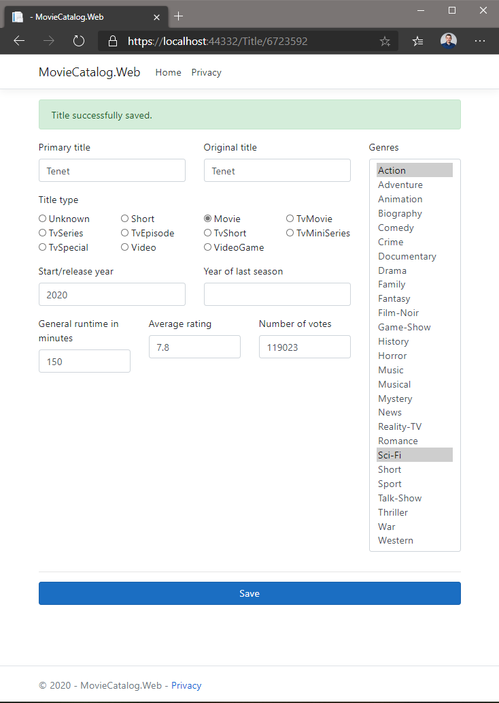

# 2. feladat

## Beszúrás & módosítás - specifikáció

A filmlistából lehessen elnavigálni egy új oldalra (pl. a címre, mint linkre kattintva), ahol a mű adatait
szerkeszthetjük. Emellett egy főoldalon lévő külön gombbal/linkkel is ugyanerre az új oldalra lehessen navigálni, de
ilyenkor új művet lehessen felvenni.

- A szerkesztés önálló oldalon legyen, a `/Title/{Id:int?}` URL-en legyen elérhető!
- Az `Id` paraméter/tulajdonság tehát URL-ből jön (ha van), és GET kérés hatására is ki kell töltődnie.
- Ha `Id` nincs megadva, akkor egy üres `Title` létrehozását végezzük.
- Ha az `Id` meg van adva, a film adatait töltsd ki az adatbázis adatai alapján!
- Használd az `asp-for` adatkötést a tulajdonságok megjelenítéséhez!
- A mentés ugyanezen URL-en keresztül történjen, viszont POST művelet hatására végződjön el. Mentés után GET kéréssel
  menjünk vissza az oldal szerkesztő felületére (lásd: [PRG](https://en.wikipedia.org/wiki/Post/Redirect/Get)).
- Típusból (`TitleType`) csak egyet, műfajból többet is meg lehet adni. A felhasználó e kettő adatnál választhasson az
  értékek közül egy-egy listából.
- A műfajok listáját értelemszerűen külön lekérdezésben le kell kérdezni POST és GET esetén is.

### Validációk

Készíts [validációt](https://learn.microsoft.com/en-us/aspnet/core/tutorials/razor-pages/validation?view=aspnetcore-6.0&tabs=visual-studio#add-validation-rules-to-the-movie-model)
is az elemekre!

- Jelenítsd meg a validációs hibákat az `asp-validation-summary` Tag Helper segítségével!
- Mentés csak akkor történhet, ha a validáció sikeres volt (`ModelState.IsValid`)! Ha a modell állapota nem valid, a
  jelenlegi oldal visszaadásával az adatkötések megfelelően lefutnak és kitöltésre kerülnek a validációs hibák, a
  felületen megadott értékek pedig betöltődnek a megfelelő mezőkbe.
- Használhatod
  a [TempData](https://docs.microsoft.com/en-us/aspnet/core/fundamentals/app-state?view=aspnetcore-3.1#tempdata)
  objektumot adat átadására HTTP kérések között.
- Validációk:
    - címek: max 500 karakter, kötelező.
    - évszámok: 1900 és 2100 között.
    - időtartam (perc): 1 és 9999 között.
    - Műfajok: maximum 3 db.

## Megvalósítás lépései

Nem kötelező így csinálni, de egy lehetséges megoldás lépései a következők.

1. Vegyél fel egy új Razor page-et *Title* névvel a *Pages* mappába.

1. A razor felület egy lehetséges megvalósítását megtalálod [itt](./snippets/Pages/Title.cshtml). Ezt felhasználhatod,
   de a kód értelmezése ilyenkor a te feladatod. Nem fog fordulni a kód, lesznek benne nem feloldott hivatkozások az
   `asp-for` attribútumok értékében, illetve a `Model` objektum tagjai esetében. Vedd fel a szükséges property-ket és
   függvényeket a `TitleModel`-be. A property-k esetében alkalmazd validációval és az adatkötéssel kapcsolatos
   attribútumokat. Vedd fel az `Id` property-t is, ez GET esetén is töltődjön ki. A `SuccessMessage` property legyen
   a [TempData](https://docs.microsoft.com/en-us/aspnet/core/fundamentals/app-state?view=aspnetcore-3.1#tempdata) része.
   A függvényimplementációk, ha adatbázisadatra van szükségük, használják az `IMovieCatalogDataService` függvényeit -
   ehhez előbb DI-ból kell kapnia a page model-nek egy `IMovieCatalogDataService` példányt.

1. Az `OnGet` függvény, ha az `Id` ki van töltve, töltse fel a property értékeket az adatbázis alapján.

1. Valósítsd meg a POST
   műveletet [ezen példa szerint](https://learn.microsoft.com/en-us/aspnet/core/mvc/models/validation?view=aspnetcore-6.0#model-state).
   Az adatbázisművelethez használd most is az `IMovieCatalogDataService` függvényét. Állítsd be a `SuccessMessage`-t is,
   ha minden sikeresen lefutott. Siker esetén az átirányítás *Title* oldalra történjen GET művelettel, pl. ha az
   új/módosított elem azonosítója 5, akkor a */Title/5*-re irányíts át.

1. Módosítsd az *Index* oldalt, hogy a filmlistában a film címe linkkel a *Title* oldalra jussunk mégpedig szerkesztő
   módban, azaz a film aktuális adataival legyen feltöltve a felület.

1. Adj hozzá az *Index* oldalhoz egy
   új [link-gombot](https://getbootstrap.com/docs/5.0/components/buttons/#button-tags), ami egyszerűen a *Title* oldalra
   linkel, hogy így beszúró módban jelenjen meg a *Title* oldal.

## Végső kinézet

Teszt URL:

```
/Title/5723720
```



## Tippek

- Használd az alábbi attribútumokat: `BindProperty`, `TempData`, `Display`, `Required`, `StringLength`, `Range`,
  `MaxLength`!
- A `SelectListItem` konstruktorában tudod megadni, hogy ki legyen-e választva egy műfaj. A kiválasztott műfajok
  azonosítói egyszerű `List<int>` típusban tárolhatók (és adhatók át a mentést végző metódusnak).

## Beadandó tesztesetek

- Sikeres beszúrás az `Index` oldalról indulva (a beszúrást indító link URL-je látható a böngészőablak alján). Az új
  film címe legyen a neptun kódod.
- Sikeres módosítás az `Index` oldalról indulva (a módosítást indító link URL-je látható a böngészőablak alján), a
  műfajbesorolás is változzon.
- Sikertelen módosítás validációs hiba miatt.

## Következő feladatok

- Folytasd a [lapozással](Feladat-3.md)
