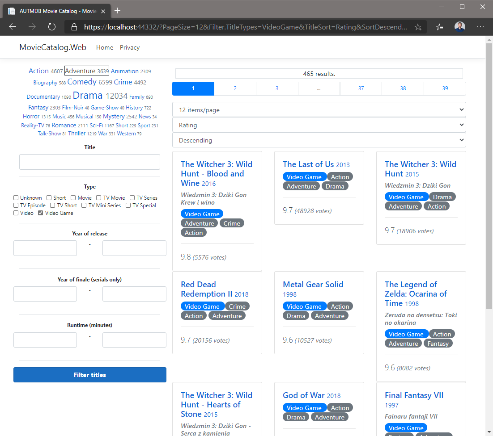

# Feladat 4.

## Szűrés - specifikáció

A szűrést a kezdőoldalon (*Index*) kell megvalósítani, minden paraméter URL-ben utazzon! Alapértelmezetten ne legyen semmilyen szűrés (az első feladatban még volt).

A szűréshez az oldal tetején és/vagy alján kell szerepelnie egy lapozósávnak az alábbinak megfelelően:
- összesen egy darab szűrőmező a címeknek
- jelölőnégyzet-lista a típusnak (`TitleType`)
- minden számhoz, évszámhoz két-két szűrőmező (min-max értékek)
- a műfajokat az első feladat bal oldali "műfajfelhője" helyett a műfajok is jelölőnégyzet listából legyenek választhatók, a feliratok viszont maradjanak ugyanazok (tartalmazzák a számosságokat).
- a műfajok számosságának nem kell módosulnia a szűrés használata során

## Megvalósítás lépései

Nem kötelező így csinálni, de egy lehetséges megoldás lépései a következők.

1. Vegyél fel egy új `TitleFilter` típusú property-t az `IndexModel`-be `Filter` néven. Ne legyen nullozható, kezdeti értéke legyen egy új konstruktorral. A property automatikusan állítódjon be a HTTP kérés (query string) alapján (`BindProperty` attribútum) [GET kérés esetén is](https://learn.microsoft.com/en-us/aspnet/core/mvc/models/model-binding?view=aspnetcore-6.0#model-binding-for-http-get-requests-1) (`SupportsGet`). 

1. Módosítsd a `GetTitlesAsync` hívását, hogy az előbb felvett property alapján szűrjön.  Próbáld ki, hogy a böngésző címsorában kiegészítve a címet, tudod-e vezérelni a lapozást és a szűrést is.

    Hogyan tudjuk megadni ezt a komplex objektumot URL paraméterként? Például: *&Filter.Genres=Sci-Fi*. Ezzel láthatjuk, hogy kitöltődik megfelelően a `Genres` lista egyetlen elemmel, ami a *Sci-Fi*. Ha több elemet szeretnénk megadni, akkor többször soroljuk fel ugyanazt a kulcsot (a query paraméterben szabvány szerint nem történik "sorosítás", tehát nem használunk tömböket vagy JSON objektumokat, csak egyszerű értékeket string kulccsal): *&Filter.Genres=Sci-Fi&Filter.Genres=Action*. Arra is figyelnünk kell, hogy az URL-ben a lapozó paraméterek is benne legyenek. Példa URL: 
    ```
    /?PageSize=20&PageNumber=1&TitleSort=ReleaseYear&SortDescending=True&Filter.Genres=Comedy
    ```

1. Kommentezd ki a műfajfelhő rész razor kódját.

1. A szűrő űrlap egy lehetséges megvalósítását megtalálod [itt](./snippets/index.filter.cshtml). Helyezd el úgy a saját oldaladba, hogy a kikommentezett rész helyén jelenjen meg. Ha ezt használod, ellenőrizd, hogy a razor kódban található modellhivatkozások a te saját modellednek megfelelő property nevekre hivatkoznak-e. Ha nem, írd át a hivatkozást megfelelő névre. A kód értelmezése ilyenkor a te feladatod, némi segítség található lentebb.

1. A szűrőfelület űrlapjának *Genres* részén lévő üres *div*-et töltsd ki egy hasonló ciklussal, mint ami a *TitleTypes* részen van, de itt a műfajokat listázd. Figyelj rá, hogy a `Filter.TitleTypes` helyett a `Filter.Genres`-t használd, a feliratok viszont a műfajok nevei legyenek, és továbbra is tartalmazzák a számosságokat.

## Végső kinézet



## Beadandó tesztesetek

- Legalább két darab, különbözőképpen felparaméterezett szűrés. Szövegesen szerepeljen a jegyzőkönyvben a szűrés gomb megnyomása utáni teljes URL is.

## Következő feladatok

Folytathatod a [szerkesztő oldallal](Feladat-2.md), ha még nem csináltad korábban.

:godmode: Egyébként végeztél a feladatokkal. :godmode: 
