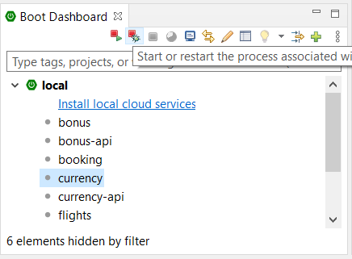

# 1. Feladat: Config server

Indítsd el a currency alkalmazást, majd a bonus alkalmazást (Pl. jobb klikk > Run as... > Spring Boot App). Azt tapasztalod, hogy az egyik nem fog elindulni, mert mindkettő a default 8080-as porton szeretne elindulni, és a korábban elinduló már elfoglalja ezt a portot. 

Az egy gépen történő futtatáshoz mindenképp külön portot kell beállítani az alkalmazásoknak. A booking projektben lévő src\main\application.proprerties ben látható is, hogy server.port=9080, így ez nem akadna össze a többivel. 

De a légitársaság a belső szolgáltatásait nem az egyes alkalmazások belső konfig fájljaiban akarja konfigurálni, hanem egy központosított helyen, ezért egy konfig szervert fog bevezetni. A konfig szerver egy külön alkalmazás lesz (a neve pl. *config*), amelyeknek a bonus, currency és flights alkalmazások a kliensei lesznek, vagyis ettől fogják lekérdezni induláskor a saját konfigurációjukat. A Spring Cloud Config projekt beépítve tartalmaz támogatást a szerver és a kliens oldalhoz is, amit az alábbi módon vehetünk igénybe:

1. Hozz létre egy új projektet, *config* néven. Ha STS-t használsz, a leggyorsabb ezt a File > New > Spring Starter Project menüből indítani. 11-es Java-t és Mavent válassz a varázsló első oldalán, majd a második oldalon a választható függőségek közül a Spring Cloud Config csoport alatt a Config Server-t.

2. Vizsgáld meg a keletkező pom.xml-t. Látható, hogy a parent projekt ugyanúgy a spring-boot-parent, ahogy azt megszoktuk. Viszont létrejött egy dependencyManagement tag, amely a spring cloud-os függőségeket húzza be. (Az aktuális Spring Cloud verzió a 2020.0.4, ami property-be van kiszervezve):

   ```
   <dependencyManagement>
   	<dependencies>
   		<dependency>
   			<groupId>org.springframework.cloud</groupId>
   			<artifactId>spring-cloud-dependencies</artifactId>
   			<version>${spring-cloud.version}</version>
   			<type>pom</type>
   			<scope>import</scope>
   		</dependency>
   	</dependencies>
   </dependencyManagement>
   ```
   A dependencyManagement tag nem összekeverendő a dependencies taggel! Ha egy konkrét Spring cloud-os függőséget ténylegesen használni akarunk, akkor azt a dependencies tagbe kell tenni, persze a verziót elhagyhatjuk, mert azt megkajuk a dependencyManagement tagből:

   ```
   <dependencies>
   		<dependency>
   			<groupId>org.springframework.cloud</groupId>
   			<artifactId>spring-cloud-config-server</artifactId>
   		</dependency>
   		...
   </dependencies>
   ```

   

3. A varázsló létrehozott egy application.properties fájlt, de mi yml formában konfiguljuk az alkalamzásunkat, ezért hozzunk létre egy application.yml fájlt az src\main\resources alatt. Ebbe az alábbi tartalom kerüljön:

   ```
   server:
     port: 8081
   spring:
     application: 
       name: config
     profiles:
       active: native  
     cloud:
       config:
         server:
           native:
             search-locations: classpath:/config
   ```

   A konfig eleje értelemszerűen a config szerver portját állítja 8081-re. Az alkalmazás neve az lesz, hogy *config*, majd bekapcsoljuk a "native" profile-t. Ennek hatására a config szerver nem egy git repoból próbálja majd olvasni a konfig fájlokat (ami amúgy valós környezetben hasznos lehetne), hanem lokális fájlrendszerből. Hogy pontosan honnan, azt a következő konfig adja meg: a classpath config könyvtárából.

4. Hozzuk létre az src\main\resources alatt a config könyvtárat, abban pedig 3 yml fájlt: bonus.yml, flights.yml, currency.yml. Ezekben konfigoljunk nem ütköző portokat a három alkalmazásnak. A currency.yml-ben pedig ezen felül még az átváltási jutalékot is állítsuk 1.5 %-ra:

   ```
   server:
     port: 8083
   currency:
       exchangePremium: 0.015
   ```

5. A config projekt main osztályára (ConfigApplication) tegyük rá a *@EnableConfigServer* annotációt, ezzel a konfig szerver elkészült.

6. Most a három légitársasági alkalmazást állítjuk be, hogy a konfig szervert konfig kliensként használják. Az alábbi lépéseket mindháromra (bonus, currency, flights) végezzük el. 

   - A pom.xml-ben:

     - A &lt;properties&gt; tagbe helyezzük el ezt a sort:

     ```
             <spring-cloud.version>2020.0.4</spring-cloud.version>
     ```

     - A &lt;properties&gt; tag alá helyezzük el ezeket a sorokat:

     ```
         <dependencyManagement>
             <dependencies>
                 <dependency>
                     <groupId>org.springframework.cloud</groupId>
                     <artifactId>spring-cloud-dependencies</artifactId>
                     <version>${spring-cloud.version}</version>
                     <type>pom</type>
                     <scope>import</scope>
                 </dependency>
             </dependencies>
         </dependencyManagement>
     ```

     - A spring-boot-starter-web függőség után illesszük be ezeket a sorokat:

       ```
               <dependency>
                   <groupId>org.springframework.cloud</groupId>
                   <artifactId>spring-cloud-starter-config</artifactId>
               </dependency>
       ```

   - Hozzuk létre a application.properties fájlt az src\main\resources alatt, ezzel a tartalommal (a *name* utáni érték értelemszerűen az adott projektnek megfelelő legyen):

     ```
     spring.application.name=bonus
     spring.config.import=optional:configserver:http://localhost:8081
     ```
     
     - Megjegyzések: 
       - A fenti két propertyt application.yml-ben is megadhatnánk. A currency projektben pl. már eleve application.yml fájlunk van, amiben az átváltási jutalékot definiáljuk. Kiegészíthettő lenne tehát ilyen módon:
     ```        
     currency:
        exchangePremium: 0.01
     spring:
        application:
          name: currency
        config:
          import: optional:configserver:http://localhost:8081
     ```
       - Az optional: prefix azt szolgálja, hogy az alkalmazásunk akkor is el tudjon indulni, ha a konfig szerver nem elérhető. Ha azonban ez előfordulna, visszajutnánk a kezdeti problémához: a default 8080-as porton akarna elindulni minden alkalmazás. Tehát a helyes működéshez a config szervert kell majd először elindítani.
       - Ha nem tudjuk vagy akarjuk biztosítani, hogy a config szerver induljon el először, az alkalmazásokat beállíthatjuk úgy is, hogy induláskor többször próbálkozzanak a config szerver elérésével, erről itt olvashatók részletek: https://docs.spring.io/spring-cloud-config/docs/current/reference/html/#config-client-retry
       - A Spring Boot 2.4 vezette be a spring.config.import property-t, amivel a fenti módon, egyszerűen lehet máshonnan (jelen esetben egy config szerverről) konfigurációt importálni. Korábbi verziókban egy bootstrap.yml fájlra volt szükség, ott kellett megadni az alkalmazás nevét és a config szerver elérhetőségét (a spring.cloud.config.uri property-ben). Ha a régi módon, a bootstrap.yml-t akarnánk használni, a spring.cloud.bootstrap.enabled=true property-vel, vagy a spring-cloud-starter-bootstrap függőség behúzásával tudnánk megtenni.

7. Indítsd el a config alkalmazást, majd sorban a bonus, currency és flights alkalmazásokat! Jól használható erre a célra a bal alsó sarokban lévő Boot Dashboard nézet, ahol gyorsan kiválasztható bármelyik alkalmazás, ami után egyszerű vagy debug módú futtatás kezdeményezhető a megfelelő ikonnal. (Ha már fut az alkalmazás, akkor először le is állítja azt, így nem kell portütközéstől tartani. A *-api projekteket értelemszerűen nem lehet elindítani, mert nincs bennük main osztály.)

   

8. Készíts két képernyőképet a jegyzőkönyvbe:

   1. Az elsőn látszódjon a currency.yml megnyitva az IDE-ben, és mellette egy böngészőben az átváltó API meghívásának eredménye, USD -> HUF irány esetére
   2. A másodikon látszódjon a bonus.yml megnyitva az IDE-ben, és mellette egy böngészőben a saját NEPTUN kódodnak megfelelelő user bonusának lekérdezése

   

## Következő feladat

Folytasd a [következő feladattal](Feladat-2.md).
