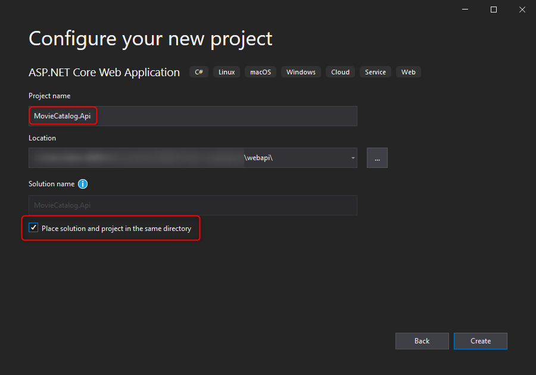
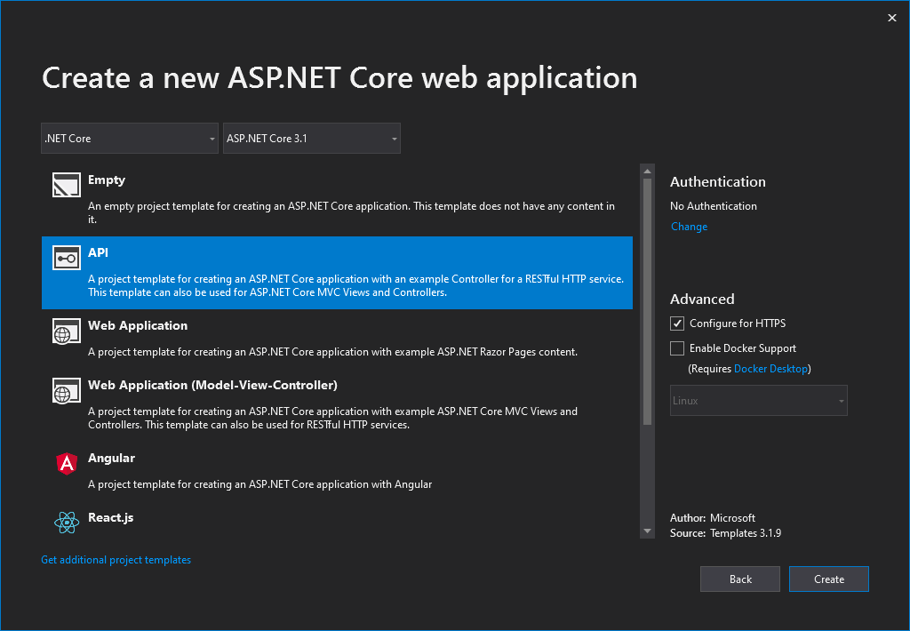
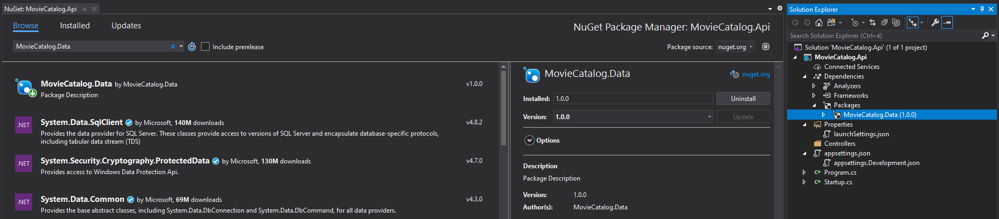
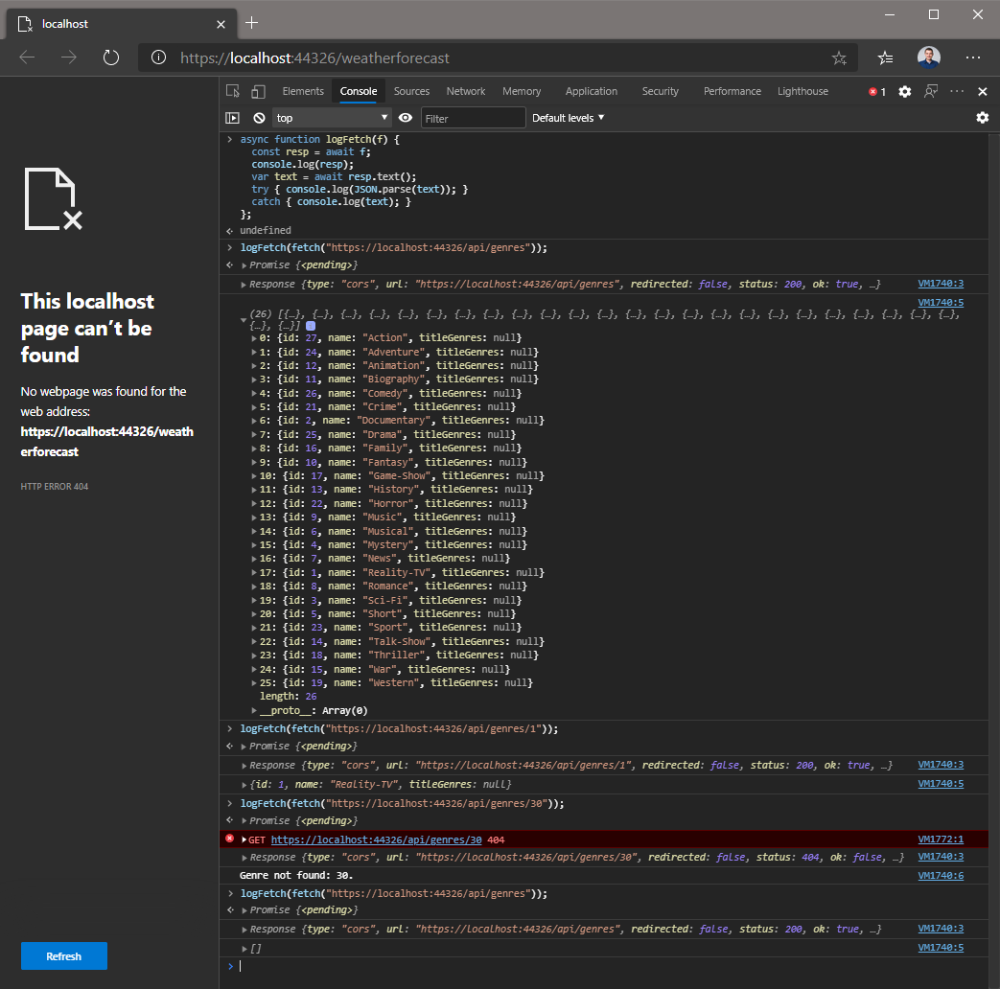

# Előkészítés

Az [Entity Framework laboron](../ef/README.md) készült adatmodellt (kissé kibővítve) fogjuk hasznosítani, hogy egy RESTful API-t készítsünk ASP.NET Core-ban.

1. Hozz létre egy új ASP.NET Core Web Application típusú alkalmazást `MovieCatalog.Api` néven az alábbi ábráknak megfelelő módon!
    - VS verziótól függően kissé eltérhetnek a képek a valóságtól, ahol nincs releváns opció, ott használd az alapbeállítást!
    - .NET verziónak a jelenlegi (félév elején) legfrissebb stabil verziót használd, tehát vonj ki az aktuális évből 2016-ot!


1. Nem lesz szükség a létrejött projektben az alábbi fájlokra, ezek törölhetők:
    - `Controllers/WeatherForecastController.cs`
    - `WeatherForecast.cs`
1. Adj hivatkozást a MovieCatalog.Data NuGet csomagra (a legfrissebb elérhető verzióra)!

1. A NuGet csomagban található a teljes adatmodell és adatelérési réteg. A MigrateAndSeedDateAsync() bővítő metódus a kiszolgálón, mielőtt elindítanánk a HTTP kérések fogadását, elvégzi az adatbázis sémájának létrehozását, valamint feltölti azt a kiinduló adatokkal. A Main függvény legyen lecserélve az alábbira:
    ``` C#
    public static async Task Main(string[] args) =>
        await (await CreateHostBuilder(args).Build().MigrateAndSeedDataAsync()).RunAsync();
    ```
1. Add hozzá a fejlesztésre szánt kapcsolódási karakterláncot az appsettings.Development.json fájlhoz (az appsettings.json "mögött" bújik meg):
    ``` JSON
    {
        "ConnectionStrings": {
            "MovieCatalog": "Server=(localdb)\\mssqllocaldb;Database=MovieCatalog;Trusted_Connection=True;MultipleActiveResultSets=true"
        },
        "Logging": { ... }
    }
    ```
1. A Startup osztályban add hozzá a saját adatszolgáltatást (`IMovieCatalogDataService`) és a saját DbContextet a szolgáltatáskonténerhez, ennek paraméterül add át a megfelelő ConnectionStringet a konfigurációból:
    ``` C#
    using Microsoft.EntityFrameworkCore;
    using MovieCatalog.Data;
    // ...

    services.AddMovieDataService();
    services.AddDbContext<MovieCatalogDbContext>(options =>
        options.UseSqlServer(Configuration.GetConnectionString("MovieCatalog")));
    ```

A fentiek segítségével elértük, hogy:
- van adatbázisunk, ami induláskor szükség szerint létrejön és feltöltődik adatokkal,
- az IoC (DI) konténertől elkérhetjük a `MovieCatalogDbContext`-et az alkalmazásban,
- az IoC (DI) konténertől elkérhetjük az `IMovieCatalogDataService`-t az alkalmazásban (ami pedig eléri a DB-t a `MovieCatalogDbContext`-en keresztül).

# Feladat 1.

Készíts egy új API Controllert GenresController néven! A controller az alábbi műveleteket tudja elvégezni:
- `GET /api/genres`
  - az összes műfaj lekérdezése,
  - ha üres a műfajok listája, nem üres (/null) visszatérésnek, hanem üres kollekció (`[]`) visszatérésnek kell jönnie (200 OK).
- `GET /api/genres/<ID>`
  - a megadott ID-jú genre objektum lekérdezése,
  - ha az ID azonosítójú elem nem található, visszatérés 404-gyel.

Beadandó: 
- Az elkészült Controller kódjáról készült kép(ek).
- 4 képernyőkép, ahol a 4 feltételnek megfelelő kérésre érkező válaszokat láthatjuk tetszőleges böngészőből vagy HTTP hibakereső eszközből indítva.
  - Az üres lekérdezéshez mindenképp szükséges az adatbázis kézi manipulációja!

Tudnivalók, megjegyzések, tippek (a teljes laborra vonatkozva):
- Régebbi .NET-en, vagy Open API nélkül az F5 hatására a szerver elindul, automatikusan a https://localhost:443xy/weatherforecast URL-re kerülünk. Mivel a szerverünknek nincsen felülete, a `WeatherForecastController`t pedig töröltük, ezért itt egy 404-es oldal fogad minket. Ez nem gond, de ha a kezdő URL-t szeretnéd átírni, akkor a projekten belül a Properties/launchSettings.json fájlban teheted meg (`launchUrl` mező átírása vagy törlése).
  - Open API-val kapunk egy általános API böngésző felületet a /swagger URL-en. A kérés-válaszok vizualizációjához ez is használható, és a beadandóban is elfogadott.
- Mindenképp javasolt ismerni a szükséges attribútumokat (pl. `[HttpGet]`) és visszatérési értékek típusait, különös tekintettel az `ActionResult<T>` típusra.
- A labor során használható az elkészült adatrétegben található `IMovieCatalogDataService` szolgáltatás. Ha valamely funkció megvalósításához szükséges, használható a `MovieCatalogDbContext` adatbáziskontextus is, viszont ezt inkább csak indokolt esetben használd!
  - A "profik" készítenek egy saját származtatott IMovieCatalogDataService-t, aminek implementációja az eredeti szolgáltatásba (amit DI-ból kap meg) áthív (proxy-z), és kibővíti a szükséges további funkciókkal.
- Elakadás esetén vagy kiindulásként használható legenerált controller osztály is (Add --> Controller --> API Controller with actions, using Entity Framework VAGY EF nélkül), viszont az automatikus generálást erősen át kell írni a helyes működéshez, ezért érdemes lehet inkább másik fájlba és más névvel létrehozni, inspirálódni és később törölni azt.
- A későbbiekben beadandók a HTTP kérés/válaszok reprezentációi. Ezeket indítani HTTP hibakereső eszközből (pl. Fiddler, Postman) lehet, de más eszköz is használható. 
  - Végső esetben használható a böngészőben futó egyszerű JavaScript alkalmazás is vagy a böngészőben JavaScript konzolban futtatott [fetch parancs](https://developer.mozilla.org/en-US/docs/Web/API/Fetch_API/Using_Fetch).
  - Ekkor a CORS explicit engedélyezése szükséges a Startup osztályban (ezt ne csináljuk éles alkalmazásban):
    ``` C#
    app.UseCors(b => b.AllowAnyOrigin().AllowAnyMethod().AllowAnyHeader());
    ```
  - Ebben az esetben a futtatott fetch parancsnak/egyszerű JS alkalmazásnak és a válasznak (törzs és státuszkód) kell látszódnia a beadott anyagban (a szokásos személyes azonosításon túl), pl:
  
  - Használható az alábbi egyszerű segédfüggvény:
    ``` JS
    async function logFetch(f) {
      const resp = await f;
      console.log(resp);
      var text = await resp.text();
      try { console.log(JSON.parse(text)); }
      catch { console.log(text); }
    };
    ```
- A szerver, ha a kliens máshogy nem kéri, alapértelmezés szerint JSON objektummal tér vissza. Ezért nem szép dolog a controller törzsében `Json()` visszatérést alkalmazni (a kliens lehet, hogy pl. XML-t kért). Ehelyett az Ok()-t használhatjuk, vagy még jobb, típusos API-t pl. `ActionResult<T>`-vel.
- Ha egy objektumot a törzsben várunk, annotálni érdemes a [FromBody] attribútummal a paramétert (nem szükséges, de így egyértelmű, hogy melyik paraméter érkezik a törzsben). Közvetlenül az entitást is várhatjuk, de az nagyon csúnya megoldás (közvetlenül módosíthatja a kliens az adatbázist, a szerver kifejezett felügyelete nélkül), ezért érdemes DTO objektumot létrehozni minden esetben, amikor kommunikáció történik (befelé ÉS kifelé is). Ez azt jelenti, hogy az API-n paraméterül várt és visszaadott (sorosított) objektumokat mind érdemes egyedileg definiálni. Ezt az MVC értelmében modelleknek nevezzük, érdemes őket az Api projekt Models mappájába helyezni (megfelelő elnevezésekkel).
- Általánosságban érdemes nem üres 404-es üzenettel, hanem konkrét hibaüzenetet tartalmazó 404-es üzenettel visszatérni, különben esetenként nehezen kideríthető, hogy az API végpontot nem találtuk meg, vagy azt megtaláltuk, de a "helyes" válasz 404 volt.
- Ha szeretnéd elkerülni a kód duplikálását, érdemes saját szolgáltatást létrehoznod, amibe a közös funkciók (pl. entitás<->DTO átalakítások) kerülhetnek. A szolgáltatást be kell regisztrálni a `Startup.ConfigureServices` metódusban, ezután használható lesz függőséginjektálással pl. controllerekben. Jellemzően a HTTP kérés idejéig élő (Scoped) függőségként érdemes beregisztrálni ezt:
  - `services.AddScoped<MyGenreService>();`

## Következő feladat

Folytasd a [következő feladattal](Feladat-2.md).
