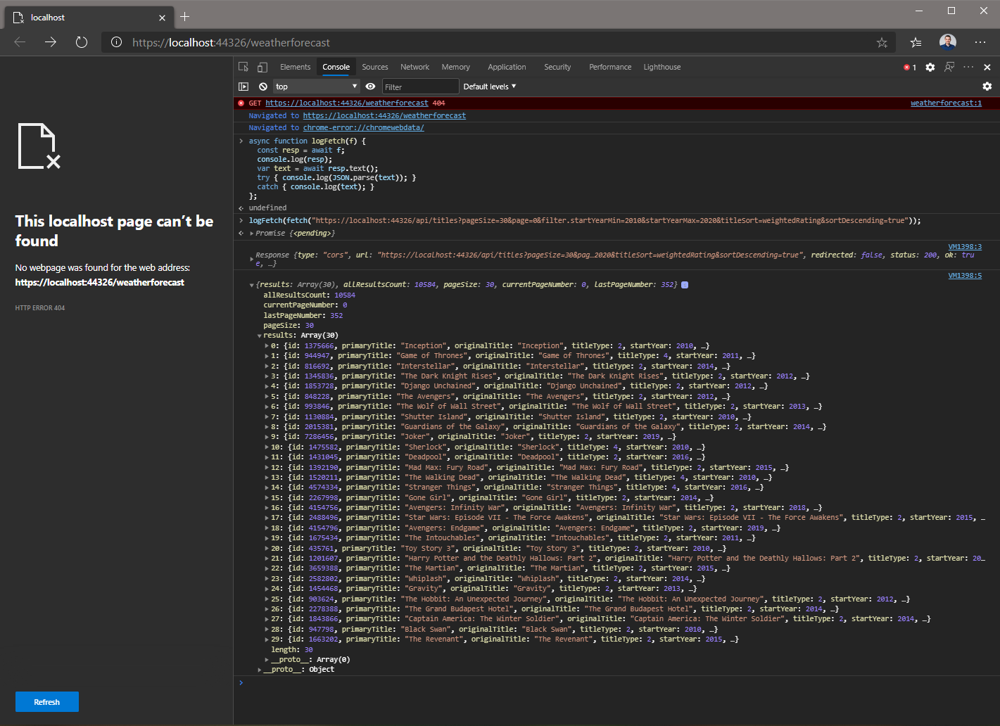

# Feladat 4.

Természetesen, mivel az adathalmaz nagy, nem adunk vissza minden létező elemet a művekre érkező GET hívásra, mert az hatalmas hálózati forgalmat indukálna a szerver és az adatbázis, valamint a kliens és a szerver között, valamint jelentős terhelést eredményezne mindhárom fél számára. Ezért a műveket csak lapozott formában lehet elérni. Erről már az adatréteg rész gondoskodik is számunkra.

A művek lekérdezéséhez egy komplexebb szűrő is készült `MovieCatalog.Data.MoviesFilter` néven. Ez a szűrő objektum átadható paraméterül az `IMovieCatalogDataService.GetTitlesAsync` metódusnak megfelelő paraméterezéssel. A metódus lapozást, szűrést és rendezést tesz lehetővé

A feladat a `GET api/titles` végpont elkészítése az alábbi feltételekkel:
- Visszatérés `ActionResult<PagedResult<TitleModel>>` objektummal. Az entitások tehát transzformálandók memóriában, miután az eredményt lekérdeztük az adatrétegtől (a `PagedResult.Transform` metódus használható).
- A lekérdezés minden paramétere az URL-ben utazzon, tehát a lapozáshoz, szűréshez és rendezéshez tartozó összes paraméter egyaránt! Komplex objektumokat az MVC automatikusan törzsből érkező adatként kezel, ezt kikerülni azzal lehet, ha az objektumot attribútáljuk a `[FromQuery]` paraméterrel.
- Működnie kell (értelemszerűen helyesen) az alábbi URL-ekre érkező GET műveleteknek:
  - `api/titles` és `api/titles?pageSize=10&page=0`: mindkét esetben visszaadja a 0. oldalhoz, 10-es pageSize-hoz található választ, minden alapértelmezés szerinti további paraméterre, azaz cím szerinti rendezéssel növekvő sorrendben, szűrés nélkül.
  - `api/titles?pageSize=101`: 400-as hibával tér vissza, mert 100-ban maximáljuk a maximális oldalszámot.
  - `api/titles?page=-1&pageSize=0`: hibás oldalparaméterezés esetén 400-as válasszal kell visszatérni (transzformálandó a megfelelő `ArgumentException`, ha rossz a paraméterezés).
  - `api/titles?pageSize=30&page=0&filter.startYearMin=2010&startYearMax=2020&titleSort=weightedRating&sortDescending=true`

## Végeztél

Végeztél a feladatokkal.
